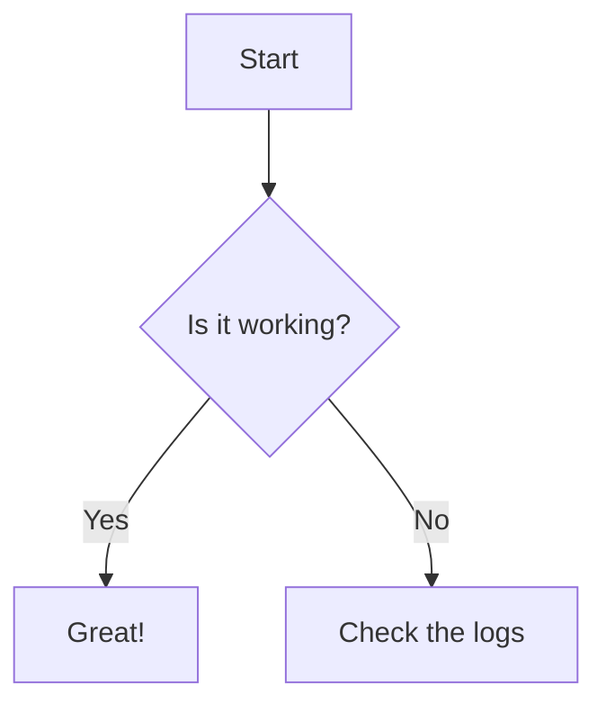

# A Guide to Enhanced Markdown Writing

<!-- prettier-ignore -->
!!! note
    This guide assumes you already know the basics like headings (`#`), lists (`*`, `1.`), and links (`[text](url)`). We will focus on the powerful features that turn simple notes into structured, readable, and professional-looking documents.

To create rich, consistent, and easily navigable content, follow these conventions. They leverage powerful extensions to make your notes more effective.

#### 1. The Foundation: Metadata (Frontmatter)

Every Markdown file should begin with a metadata block, also known as "frontmatter." This block is enclosed in `---` and provides crucial information about the page.

```yaml
---
title: "The Title of Your Page"
date: YYYY-MM-DD
tags:
  - Keyword 1
  - Another Topic
  - Important Concept
---
```

- **`title` (Required):** This sets the official title of the page, which appears in the browser tab and navigation sidebar. It should be concise and descriptive.
- **`date` (Recommended):** The date the note was created or last updated. Use the `YYYY-MM-DD` format for consistency.
- **`tags` (Highly Recommended):** A list of keywords that describe the content. This is the single most powerful tool for organizing and discovering related information across your entire collection of notes.

#### 2. Highlighting Key Information: Admonitions

Use admonitions (also called callouts) to draw attention to important information. They are perfect for definitions, warnings, examples, or key concepts.

<!-- prettier-ignore -->
!!! note "This is a note"
    Use this for general information, definitions, or side comments.

<!-- prettier-ignore -->
!!! tip "This is a tip"
    Use this for helpful advice, shortcuts, or best practices.

<!-- prettier-ignore -->
!!! warning "This is a warning"
    Use this for critical information that requires the reader's attention, such as potential mistakes or important prerequisites.

<!-- prettier-ignore -->
!!! abstract "Key Concepts"
    Use this to summarize the main takeaways of a section.

#### 3. Hiding Complexity: Collapsible Blocks

For worked examples, long solutions, or supplementary information that isn't essential to the main text, use collapsible blocks. This keeps your pages clean and lets the reader choose when to see the details.

<!-- prettier-ignore -->
???+ example "Worked Example: Step-by-Step Solution"
    This content is hidden by default. The user can click to expand it.

    1.  First step of the solution.
    2.  Second step with more details.

#### 4. Showing Multiple Perspectives: Content Tabs

When you need to present information from different angles (e.g., theory vs. code, different methods), content tabs are the perfect tool.

<!-- prettier-ignore -->
=== "Theoretical View"
    This tab explains the theory behind a concept.

<!-- prettier-ignore -->
=== "Practical Example"
    This tab shows a practical code example or application.

#### 5. Displaying Code Effectively

For technical notes, clear code blocks are essential. Always specify the language for syntax highlighting.

**Syntax Highlighting with Title and Line Numbers:**

```python title="example.py" linenums="1"
def greet(name):
    """This function greets the person passed in as a parameter."""
    print(f"Hello, {name}!")

greet("World")
```

**Highlighting Specific Lines:**

Use `hl_lines` to draw attention to important lines in a code block.

```javascript hl_lines="3 5-6"
function calculateTotal(items) {
  let total = 0;
  for (const item of items) {
    // This is the important calculation
    total += item.price * item.quantity;
  }
  return total;
}
```

#### 6. Writing Math and Formulas

You can write mathematical notation using LaTeX syntax.

- **Inline math:** Wrap your formula in single dollar signs: `$E = mc^2$`.
- **Block math:** Wrap your formula in double dollar signs `$$...$$` or brackets `\[...\]` for a centered, display-style equation.

  ```latex
  \[
  \lim_{x\to\infty} \left(1 + \frac{1}{x}\right)^x = e
  \]
  ```

#### 7. Visualizing with Diagrams

Use Mermaid to create simple flowcharts and diagrams directly in your notes.



#### Important: Working with Code Formatters (like Prettier)

Code formatters can sometimes break the special syntax for admonitions, tabs, and other enhancements. To prevent this, add `<!-- prettier-ignore -->` on the line directly above the block you want to protect.

**Example:**

```markdown
<!-- prettier-ignore -->
!!! note "My Unformatted Note"
    This block will be ignored by Prettier and will render correctly.
```

---

### Putting It All Together: A Template

Here is a complete example of a well-structured note using these features.

````markdown
---
title: "Topic: The Fundamental Theorem of Calculus"
date: 2025-08-20
tags:
  - Calculus
  - Integration
  - Theorems
---

# The Fundamental Theorem of Calculus

<!-- prettier-ignore -->
!!! abstract "Key Idea"
    The theorem links the concepts of differentiating a function with the concept of integrating a function.

---

## Part 1: The First Fundamental Theorem

The first part states that differentiation and integration are inverse operations.

<!-- prettier-ignore -->
???+ example "Formal Definition"
    If `f` is a continuous function on the interval `[a, b]`, then the function `F` defined by:
    \[
    F(x) = \int_{a}^{x} f(t) \,dt
    \]
    is differentiable on `(a, b)`, and `F'(x) = f(x)`.

---

## Practical Application

<!-- prettier-ignore -->
=== "Python Code"
    ```python title="integral_example.py" hl_lines="4"
    import scipy.integrate as spi

    # Define the function to integrate
    f = lambda x: x**2

    # Calculate the definite integral from 0 to 1
    result, error = spi.quad(f, 0, 1)
    print(f"The integral is: {result}")
    ```

<!-- prettier-ignore -->
=== "Explanation"
    The code uses SciPy's `quad` function to numerically compute the definite integral of `f(x) = x²` from 0 to 1, which evaluates to 1/3.
````
