# Lecture 1: The Ubiquity of Colloidal and Interfacial Phenomena

<!-- prettier-ignore -->
!!! abstract "Key Concepts Introduced"
    This lecture serves as a broad introduction to the field of colloidal and interfacial science and engineering. We will explore the fundamental questions the course aims to answer and survey a wide range of everyday phenomena—from the shape of a raindrop to the texture of ice cream—that are governed by forces acting at the molecular level on tiny particles and their interfaces.

---

## Watch here

## Administrative Overview & Course Structure

Welcome to the course! The primary objective is to understand the behavior of materials when they are broken down into tiny particles (**colloids**) and the physics that governs their **interfaces**.

<!-- prettier-ignore -->
!!! note "Course Logistics"
    - **Attendance:** Attendance is expected for all classes, whether online or in person.
    - **Evaluation Scheme:**
        - End-Semester Exam (Largest fraction)
        - Mid-Semester Exam (Second largest fraction)
        - In-Semester Evaluation (Quizzes or projects)
    - **Classes:** This week's classes will be conducted online. We will meet in person starting next week.
    - **Communication:** A class representative should email the instructor to establish a formal communication channel.

#### Recommended Textbooks & Resources

- **Primary Text:** The material and slides for this course are largely based on a popular, widely available textbook on the subject. It is highly recommended to acquire a copy from the library to follow along.
- **Additional Texts:**
  1.  _Physical Chemistry of Surfaces_ by Arthur W. Adamson: A classic text that approaches the subject from a chemistry viewpoint.
  2.  Other texts mentioned in the introductory email.
- **Online Resources:**
  - NPTEL Course from IIT Kanpur
  - NPTEL Course from IIT Madras

---

## 🗺️ Core Questions: A Roadmap for the Course

This course is structured to answer a series of fundamental questions about the behavior of colloids and interfaces. Our journey will cover the following key areas:

1.  **What are colloidal materials?** We will define colloids and establish their fundamental relationship with interfaces.
2.  **Interfacial Behavior:** A deep dive into **interfacial tension** (or surface tension).
3.  **Consequences of Interfacial Tension:** How tension manifests as the phenomena of **contact angle** and **wetting** (liquids spreading or not spreading on surfaces).
4.  **Capillary Hydrostatics:** Why and how liquids rise (or fall) in tiny tubes, examined from a more rigorous viewpoint than in introductory physics.
5.  **Association Colloids:** How colloidal particles or molecules can self-assemble to form larger superstructures.
6.  **Particle Motion & Brownian Diffusion:** Understanding the random motion of tiny particles that allows them to defy gravity and remain suspended (e.g., dust, smoke, fog).
7.  **Long-Range Interparticle Forces:** Investigating forces like the **Van der Waals forces** that act between particles.
8.  **Double-Layer & Short-Range Forces:** Exploring the electrostatic and other forces that come into play at very small separations.
9.  **Colloidal Stability:** Why are some colloidal systems (like milk) stable for long periods, while others are not? What causes them to destabilize?
10. **Real-World Applications:** Examining the role of interfacial science in detergents, pharmaceuticals, food science, paints, textiles, and the petroleum industry.

---

## 🔬 Everyday Phenomena Explained by Interfacial Science

The principles of this field are not abstract; they explain a vast array of observable, everyday phenomena.

### 1. The Shape of a Liquid Drop

Why does a falling raindrop adopt a specific shape? Why does a stream of water from a tap break up into individual droplets?

<!-- prettier-ignore -->
!!! note "Key Principles at Play"
    The shape of a liquid drop is determined by a delicate balance between **surface tension**, which tries to minimize the surface area into a perfect sphere, and external forces like **gravity** and **aerodynamic drag**, which distort it.

The process of a liquid stream breaking up involves the formation of surface waves, the development of a "neck," and the eventual pinch-off, which often creates a primary drop and smaller **satellite drops**.

- **Real-World Application:** **Inkjet printers** are a masterful application of this principle. They precisely control the formation of tiny liquid ink droplets that are directed onto paper to form an image. The goal is to create the smallest, most uniform drops possible for the highest print resolution.

### 2. Capillary Rise: Defying Gravity

Why does water climb up the walls of a thin glass tube, while mercury is depressed?

This phenomenon is driven by the interplay of forces between the liquid molecules themselves (**cohesive forces**) and between the liquid and the tube's surface (**adhesive forces**).

- **Wetting Liquids (e.g., Water on Glass):** When adhesive forces are stronger than cohesive forces, the liquid is "pulled" up the surface, causing the level to rise. The rise is more significant in narrower tubes.
- **Non-Wetting Liquids (e.g., Mercury on Glass):** When cohesive forces are stronger, the liquid pulls itself inward and away from the surface, causing the level to be depressed.

<!-- prettier-ignore -->
!!! warning "A Common Misconception"
    A simple force balance is often used in introductory physics to explain capillary rise. However, this is an oversimplification and is fundamentally incorrect. In this course, we will explore more accurate thermodynamic methods to calculate and understand this phenomenon.

<!-- prettier-ignore -->
???+ question "Thought-Provoking Question: Perpetual Motion?"
    **Question:** If a capillary tube is short, can the capillary rise be so strong that the liquid flows out of the top, creating a perpetual motion pump?

    **Answer:** No, this is not possible as it would violate the laws of thermodynamics. As the liquid rises, the meniscus (the curved upper surface) forms. If the tube is too short for the liquid to reach its equilibrium height, the meniscus will simply adjust its curvature at the top of the tube, preventing any overflow. While a true perpetual motion machine is impossible, the principle of **capillary pumping** is harnessed in microfluidic devices to move fluids without mechanical pumps.

### 3. Insects Walking on Water

How can insects like the water strider, which are denser than water, float and walk on its surface? This seemingly magical feat is a direct result of surface tension.

<figure markdown="span">
  { width="600" loading=lazy }
  <figcaption>Insects Walking on Water</figcaption>
</figure>

The insect's legs are covered in waxy, hydrophobic (water-repelling) hairs. They don't technically "float" by buoyancy (Archimedes' principle), but are instead supported by the deformation of the water's surface. The surface acts like a stretched elastic membrane, and the downward force from the insect's weight is counteracted by the upward vertical component of the surface tension force acting along the line of contact. You can see this deformation as visible dimples in the water around the insect's legs.

### 4. Spreading vs. Beading of Liquids

Why does morning dew form distinct beads on a car's waxed hood but spread into a thin film on an un-waxed, clean window?

<figure markdown="span">
  { width="600" loading=lazy }
  <figcaption>Water beading on a shiny black car hood</figcaption>
</figure>

This behavior, known as **wetting**, is dictated by the balance of interfacial energies between the solid surface, the liquid, and the surrounding air.

- **Industrial Application (Heat Transfer):** In industrial condensers, this phenomenon is critical.
  - **Filmwise Condensation:** If the condensate (e.g., water) wets the surface, it forms a continuous film that acts as an insulating barrier, reducing the rate of heat transfer.
  - **Dropwise Condensation:** If the surface is non-wetting, the condensate forms beads (drops). These drops grow, roll off the surface (picking up other drops along the way), and expose fresh surface area for condensation. This mode of heat transfer is significantly more efficient.

### 5. The Science of Adhesion (and Non-Adhesion)

What makes glue stick? And conversely, how do non-stick cooking pans work?

Adhesion is the tendency of dissimilar surfaces to cling to one another, governed by interfacial forces.

- **Cohesive Forces:** Forces holding the molecules _within_ a substance together (e.g., within the glue).
- **Adhesive Forces:** Forces between the molecules of _different_ substances (e.g., between the glue and the paper).

For a good adhesive bond, the adhesive forces must be strong, and the adhesive must be able to wet the surfaces it is joining. The science of non-stick surfaces, like Teflon-coated pans, involves engineering a surface with extremely low interfacial energy, so that food (which is mostly water or oil-based) has very weak adhesive forces with the pan.

### 6. The Stability (and Instability) of Milk

Milk is a **colloidal dispersion**—a stable mixture of tiny globules of fat and particles of protein (casein micelles) suspended in water.

<!-- prettier-ignore -->
!!! abstract "What is Colloidal Stability?"
    Colloidal stability arises from a balance of forces between suspended particles. Repulsive forces (often electrostatic) prevent them from getting too close and clumping together. If these repulsive forces are weakened, attractive forces (like Van der Waals forces) dominate, and the particles aggregate.

- **Destabilization (Curdling):**
  - **Adding Acid (e.g., making paneer/cheese):** An acid neutralizes the negative charges on the protein particles, reducing electrostatic repulsion and causing them to clump together (coagulate).
  - **Microbial Action:** Bacteria can produce acids as a byproduct of their metabolism, leading to spoilage and curdling.
  - **Making Yogurt (Dahi):** This is a _controlled_ destabilization, where bacteria create a linked network of protein particles, forming a gel-like structure.

### 7. The Puzzling Existence of Supercooled Water

We know water freezes at 0°C. Why is it possible to have liquid water remain a liquid below its freezing point? This is a **metastable state**.

The formation of a solid (an ice crystal) from a liquid requires a process called **nucleation**—the formation of a tiny initial seed crystal. This process has an energy barrier associated with creating the new solid-liquid interface. If there are no nucleation sites (like dust particles or impurities), the liquid can remain in its higher-energy liquid state even below its freezing point. This is a classic example of an interfacial phenomenon governing a thermodynamic phase transition.

### 8. Crystal Growth and the Texture of Ice Cream (Ostwald Ripening)

Why does ice cream that has been stored for a long time, or partially melted and refrozen, develop an unpleasant, crunchy texture?

The phenomenon responsible is called **Ostwald Ripening**. In a system with a mixture of small and large crystals, the smaller crystals have a higher surface energy per unit mass. To minimize the total energy of the system, molecules from the smaller crystals will dissolve and redeposit onto the surfaces of the larger crystals.

**Result:** The large crystals grow at the expense of the small crystals, which eventually disappear.

- **Application in Ice Cream:** A good ice cream has very tiny, imperceptible ice crystals, giving it a smooth texture. Ostwald ripening leads to large, gritty crystals that feel unpleasant on the tongue.
- **Prevention:**
  1.  **Chemical:** Edible emulsifiers (surfactant-like molecules) are added. They coat the surfaces of the tiny ice crystals, forming a protective barrier that inhibits the mass transfer process.
  2.  **Thermal/Kinetic:** Storing the ice cream at very low, stable temperatures (e.g., -18°C or lower) slows down the rate of molecular movement, drastically reducing the rate of ripening.

### 9. Engineering Superhydrophobic Surfaces: The Lotus Effect

How does a lotus leaf stay clean and dry, with water rolling off it in perfect spheres?

<figure markdown="span">
  { width="600" loading=lazy }
  <figcaption>The Lotus Effect</figcaption>
</figure>

<!-- prettier-ignore -->
!!! tip "The Lotus Effect"
    The lotus leaf exhibits **superhydrophobicity**, an extreme form of water repellency. This is not just due to a waxy chemical coating but is a result of a hierarchical physical structure. The leaf's surface is covered with micro-scale bumps, which are themselves coated in nano-scale waxy hairs. [Read More](https://www.jeremyjordan.me/lotus-leaf-how-nature-makes-water-repellant-materials/)

This complex structure traps a layer of air between the water droplet and the leaf surface. The droplet is therefore sitting mostly on air, not the leaf itself, minimizing adhesion and allowing it to roll off easily, picking up dust particles along the way.

- **Engineering Application:** This principle is now used to create **self-cleaning surfaces**. By texturing surfaces at the micro and nano-scale (e.g., on glass for buildings, solar panels, or vehicle windshields), we can create materials that are superhydrophobic, reducing the need for manual cleaning and improving performance.

<!-- prettier-ignore -->
!!! abstract "Section Summary: The Power of Interfaces"
    This survey demonstrates that interfacial science is not an isolated academic discipline but a powerful framework for understanding and engineering the world around us. From controlling drop formation and adhesion to ensuring the stability of food products and designing next-generation self-cleaning materials, the forces at interfaces are paramount.

---

## 🙋 Student Q&A Session

Several insightful questions were asked during the lecture, which are summarized here.

#### On Ice Cream Texture and Shelf-Life

- **Q: Why does older ice cream feel harder and taste worse?**

  - **A:** It's primarily due to **Ostwald ripening**. Over time, even at low temperatures, small ice crystals dissolve and larger ones grow, leading to a gritty, hard texture. Another factor can be temperature fluctuations (e.g., during transport or in a home freezer), which cause partial melting and refreezing, accelerating the growth of large crystals. Finally, surface frost from atmospheric moisture can form and get mixed in.

- **Q: How can the shelf-life of products like ice cream be improved to prevent this?**
  - **A:** Additives called **emulsifiers** or **stabilizers** are used. These are edible, soap-like molecules that adsorb onto the surface of the tiny ice crystals, creating a protective barrier that physically hinders the Ostwald ripening process.

#### On Crystal Polymorphs

- **Q: How does Ostwald ripening relate to crystal polymorphs (different crystalline structures of the same compound)? Does adding one polymorph accelerate the process?**
  - **A:** This is an excellent question and a variant of the same principle. Ostwald ripening is driven by a reduction in the system's total free energy. Different polymorphs have different free energies; under given conditions, one will be more stable (lower energy) than others. The less stable polymorphs will act like the "small crystals"—they will dissolve and their molecules will recrystallize into the more stable polymorphic form. This process is crucial in the pharmaceutical industry, as different polymorphs of a drug can have vastly different solubilities and therapeutic effects.

#### On Modifying Surfaces (The Lotus Effect)

- **Q: For superhydrophobic surfaces, is the effect dependent on the material's chemistry or its physical structure?**

  - **A:** It's a combination of both, but the **physical structure is often the dominant factor**. While starting with a hydrophobic material helps, it is the micro/nano-scale texturing of the surface that creates the pockets of trapped air responsible for the superhydrophobic effect. You can make a normally wetting material non-wetting simply by texturing its surface correctly. Physical texturing is often more durable than a chemical coating, which can wear off over time.

- **Q: How are the inner surfaces of materials, like a glass tube, modified chemically (e.g., silanization)?**
  - **A:** **Silanization** is a chemical process that grafts silane molecules onto a surface, modifying its properties (like making glass hydrophobic). To treat an entire object, including inner and outer surfaces, it can be done through methods like **dip-coating** (immersing the object in the chemical agent), spraying, or vapor deposition. The agent reacts with the entire exposed surface area.

---

## 🧠 Proposed Exam Questions

1.  Explain the phenomenon of **Ostwald Ripening** using the example of ice cream. Describe both the thermodynamic driving force and the kinetic mechanism. Propose two distinct industrial strategies to mitigate this effect.
2.  Compare and contrast **filmwise** and **dropwise condensation**. Which is more efficient for heat transfer and why? Relate this phenomenon to the concepts of wetting and interfacial energy.
3.  An insect can stand on the surface of water, but a steel paperclip of the same mass sinks. Explain the different physical principles governing the outcome for the insect and the paperclip. Use the concepts of surface tension and buoyancy in your answer.
4.  What is the **"Lotus Effect"?** Explain how both the chemical nature and, more importantly, the physical geometry of the lotus leaf's surface contribute to its superhydrophobicity.

---

## 📖 Glossary of New Terms

- **Adhesion:** The force of attraction between the molecules of two different substances, causing them to cling to one another.
- **Cohesion:** The force of attraction between the molecules of the same substance.
- **Colloid:** A mixture in which one substance of microscopically dispersed insoluble particles is suspended throughout another substance. The particles do not settle and cannot be separated out by ordinary filtering.
- **Contact Angle:** The angle, conventionally measured through the liquid, where a liquid-vapor interface meets a solid surface. It quantifies the wettability of a solid surface by a liquid.
- **Interface:** The boundary between two phases of matter (e.g., liquid-gas, solid-liquid).
- **Metastable State:** A state of a system that is not in its lowest energy state but has a long lifetime before it decays to the more stable state (e.g., supercooled water).
- **Ostwald Ripening:** A phenomenon observed in solid solutions or liquid sols where smaller crystals or sol particles dissolve, and redeposit onto larger crystals or sol particles.
- **Superhydrophobicity:** The property of a surface that is extremely difficult to wet. The contact angles of a water droplet on a superhydrophobic surface exceed 150°.
- **Surface Tension:** The tendency of liquid surfaces to shrink into the minimum surface area possible. It is a result of the cohesive forces between liquid molecules.
- **Wetting:** The ability of a liquid to maintain contact with a solid surface, resulting from intermolecular interactions when the two are brought together.

---

## 📊 Concept Map

```mermaid
mindmap
  root((Colloidal & Interfacial Science))
    🔬 Core Principles
      Surface Tension
        ::icon(fa fa-compress-arrows-alt)
        Minimizes surface area
      Wetting & Contact Angle
        ::icon(fa fa-tint)
        Liquid behavior on surfaces
      Colloidal Stability
        ::icon(fa fa-balance-scale)
        Balance of forces on particles
        Prevents aggregation
      Nucleation & Phase Transitions
        ::icon(fa fa-snowflake)
        Energy barrier for new phase creation
      Ostwald Ripening
        ::icon(fa fa-sort-amount-up)
        Large particles grow at the expense of small ones
    ⚡ Governing Forces
      Cohesive vs. Adhesive
        Cohesive: Within a substance
        Adhesive: Between different substances
      Van der Waals Forces
        Long-range attractive forces
      Electrostatic Forces
        Short-range repulsive forces (Double-Layer)
    🌍 Phenomena & Applications
      💧 Liquid Drop Shape
        Balance of Surface Tension, Gravity, Drag
        Application: Inkjet Printing
      ⬆️ Capillary Action
        Interplay of Cohesive & Adhesive forces
        Application: Microfluidics, Wicking
      🐜 Insects on Water
        Supported by Surface Tension
      💦 Spreading vs. Beading
        Wetting vs. Non-wetting
        Application: Efficient Heat Transfer (Dropwise Condensation)
      🧼 Adhesion & Non-Adhesion
        Governed by Interfacial Forces
        Application: Glues, Teflon Pans
      🥛 Milk Stability & Curdling
        Destabilization of a colloid
        Application: Cheese & Yogurt Making
      ❄️ Supercooled Water
        Metastable state due to nucleation barrier
      🍦 Ice Cream Texture
        Caused by Ostwald Ripening
        Prevention: Emulsifiers, Stable low temp
      🪷 Lotus Effect (Superhydrophobicity)
        Micro/Nano-scale surface structure
        Trapped air layer
        Application: Self-Cleaning Surfaces
```

