# Lecture 2: Defining Colloids, Stability, and Preparation

<!-- prettier-ignore -->
!!! abstract "Key Concepts Introduced"
    This lecture builds upon our introduction by examining a remarkable real-world application of interfacial science: selective transport membranes. We will then formally define what constitutes a **colloid**, distinguishing it from true **solutions** and coarse **suspensions**. We will explore the critical concepts of colloidal stability, aggregation, and the two primary methods for fabricating colloidal particles: the **top-down** and **bottom-up** approaches.

---

## Recap & A Final Application: Selective Transport Membranes

In our last session, we surveyed numerous everyday phenomena governed by interfacial forces. We discussed how surfaces can be engineered to be wetting or non-wetting, with applications ranging from self-cleaning glass to high-efficiency condensers. Let's explore one final, advanced application of this principle.

#### The "Smart" Fabric: Permeable to Vapor, Impermeable to Liquid

Imagine a membrane with a unique, seemingly contradictory property: it completely blocks liquid water from passing through, yet it allows water in its vapor (gas) form to pass through freely.

<!-- prettier-ignore -->
!!! note "Principle of Operation: Interfacial Forces, Not Size Exclusion"
    This is not a simple filter based on molecular size. The separation mechanism is entirely driven by **interfacial tension** and **wetting**. The membrane contains a network of pores that are so small and made of a non-wetting (hydrophobic) material that liquid water, due to its high surface tension, cannot be forced through them. The cohesive forces within the water droplet are too strong to allow it to break apart and squeeze through the pores. However, individual water vapor molecules are not bound by surface tension and can diffuse through the pores with ease.

- **Primary Application: Breathable Fabrics (Gore-Tex®)**
  - A standard rubberized raincoat is a perfect barrier to rain (liquid) but also traps perspiration (vapor). This leads to moisture buildup inside, making it stuffy and uncomfortable.
  - A breathable fabric like Gore-Tex acts as an **artificial transpiration membrane**. It keeps rain out while allowing water vapor from sweat to escape, keeping the wearer dry from both the outside and the inside.
- **Technical Applications:** This technology extends far beyond clothing. A critical use is in medical devices like **artificial lungs** (oxygenators), where oxygen and carbon dioxide must be exchanged with blood across a membrane, but the liquid blood itself must be contained.

This technology, commercialized successfully as Gore-Tex, is a prime example of how a deep understanding of fundamental interfacial science can lead to revolutionary and highly profitable commercial products.

---

## 🧬 What is a Colloid? The Spectrum of Dispersions

The term "colloid" is central to this course, so we must define it precisely. Colloidal systems occupy a fascinating intermediate state between true solutions and coarse suspensions.

### Solutions vs. Colloids vs. Suspensions: A Detailed Comparison

To understand colloids, we must place them on a spectrum of particle size.

<!-- prettier-ignore -->
=== "Suspensions"
    - **Nature:** **Heterogeneous**. The composition is uneven. You can physically distinguish the suspended particles from the medium.
    - **Particle Size:** Relatively large, typically **> 1000 nm** (1 µm).
    - **Stability:** **Unstable**. The particles are large enough that gravity will cause them to settle out (**sedimentation**) or float to the top (**creaming**) over time. They will not stay suspended indefinitely.
    - **Example:** Sand or mud in water.

=== "Colloids"
    - **Nature:** **Microscopically heterogeneous**, but often appear **homogeneous** to the naked eye.
    - **Particle Size:** Intermediate, ranging from **~1 nm to 1000 nm** (1 µm).
    - **Stability:** Generally **stable**. The particles are small enough that the random impacts from the surrounding solvent molecules (**Brownian motion**) are sufficient to keep them suspended against gravity. They do not spontaneously separate.
    - **Example:** Milk (fat and protein in water), fog (water droplets in air), paint.

=== "Solutions"
    - **Nature:** **Homogeneous**. The composition is perfectly even down to the molecular level. You cannot distinguish the solute from the solvent.
    - **Particle Size:** Atomic or molecular scale, **< 1 nm**.
    - **Stability:** **Thermodynamically stable**. The components will never separate spontaneously.
    - **Example:** Salt or sugar dissolved in water.

### The Formal Definition of a Colloid

1.  **A particle or collection of particles with at least one linear dimension between 1 nanometer (nm) and 1 micrometer (µm or 1000 nm).**

    - We use "linear dimension" because colloidal particles are often not perfect spheres. They can be rods, discs, or threads. As long as one dimension (e.g., the diameter of a rod, the thickness of a disc) falls within this range, the system can exhibit colloidal behavior.

2.  **The definition is based purely on size, not composition.**

    - Colloids can be organic or inorganic, from biological or mineralogical sources, or synthetically engineered. They can exist in various physical states.

3.  **Colloids can be single large molecules or aggregates of small molecules.**
    - **Single Macromolecules:** Many proteins and synthetic polymers are large enough on their own to be considered colloidal particles.
    - **Aggregates:** A tiny crystal of an insoluble substance (e.g., a 100 nm crystal of sugar in a hydrocarbon solvent) is a colloid formed from the aggregation of many smaller molecules.

<!-- prettier-ignore -->
!!! abstract "Section Summary: It's All About Size"
    The key takeaway is that the distinction between solutions, colloids, and suspensions is primarily one of **particle size**. This size difference dictates the dominant physical forces at play: thermodynamic solubility for solutions, Brownian motion for colloids, and gravity for suspensions. This, in turn, determines the system's long-term stability.

---

## ⚖️ Colloidal Stability and the Nature of Emulsions

Let's visualize the concept of stability using a system of two immiscible liquids, like oil and water.

An **emulsion** is a dispersion of droplets of one liquid within another immiscible liquid. Colloids are a special, fine-grained type of emulsion.

 <!-- Placeholder for a visual representation -->
_Visualizing the process: (A) Two immiscible liquids separate due to density. (B) Mechanical agitation creates a dispersion of droplets. (C) An unstable emulsion undergoes creaming, where the lighter droplets float and coalesce at the top. (D) A stable colloidal dispersion remains uniformly mixed._

- **State A (Separated):** The lowest energy, thermodynamically stable state. The system minimizes its interfacial area.
- **State B (Dispersed):** After adding energy (e.g., shaking or mixing), one liquid forms droplets within the other. This is a high-energy state.
- **State C (Unstable Emulsion - Creaming/Sedimentation):** If the droplets are large (suspension-sized), they will quickly separate due to gravity/buoyancy. The droplets rise to the top (**creaming**, if they are less dense) or sink to the bottom (**sedimentation**, if they are denser) and merge back together (**coalescence**).
  - **Real-World Example:** The formation of _malai_ (cream) on top of boiled milk is a classic example of creaming. The heat causes the small fat globules in the milk to aggregate into larger ones, which then float to the surface.
- **State D (Stable Colloid):** If the droplets are in the colloidal size range, Brownian motion overcomes the forces of gravity, and stabilizing forces between the particles prevent them from coalescing. The dispersion remains stable for a long time. **Milk itself is a prime example of a stable colloidal emulsion (State D).**

---

## 🛠️ How to Make Colloids: Top-Down vs. Bottom-Up

Colloidal particles, or more generally "subdivided systems," are created through two conceptually opposite approaches.

#### 1. The Top-Down (Dispersion) Approach

This method involves starting with a large, bulk piece of material and breaking it down into smaller and smaller pieces until they reach the colloidal size range.

- **Analogy:** Sculpting a statue from a block of marble.
- **Mechanism:** Applying mechanical energy to overcome the cohesive forces within the material.
- **Examples:**
  - **Crushing and Grinding:** Using jaw crushers, grinders, and **ball mills** to physically pulverize materials.
  - **Emulsification:** Using high-speed mixers or homogenizers to break up large liquid droplets.
- **Challenge:** This is often an energy-intensive process, and it can be difficult to achieve very small, uniform particle sizes.

#### 2. The Bottom-Up (Aggregation) Approach

This method involves starting with atoms or molecules (a true solution or vapor) and causing them to assemble or "grow" into colloidal-sized particles.

- **Analogy:** Building a structure brick by brick.
- **Mechanism:** Inducing a phase change, such as precipitation from a supersaturated solution or condensation from a vapor. Molecules come together through **nucleation** (forming an initial seed) and subsequent **growth**.
- **Examples:**
  - **Chemical Precipitation:** Mixing two solutions to form an insoluble product, like silver nitrate and sodium chloride to form tiny silver chloride crystals.
  - **Growing Silicon Wafers:** The production of large, single-crystal silicon ingots for the semiconductor industry is an extreme example of bottom-up growth where the goal is to avoid stopping at the colloidal stage and grow one massive particle.
- **Challenge:** The key is to carefully control the conditions (temperature, concentration, additives) to initiate the formation of many nuclei but then **stop the growth process** once the particles reach the desired colloidal size, preventing them from growing into a bulk solid.

<!-- prettier-ignore -->
???+ question "Thought-Provoking Question"
    **Question:** Considering the top-down and bottom-up approaches, which do you think is better for producing highly uniform (monodisperse) nanoparticles, and why?

    **Answer:** Generally, **bottom-up approaches offer much greater control over final particle size and uniformity.** By precisely managing reaction kinetics—the rates of nucleation versus growth—it's possible to have all particles start growing at roughly the same time and stop them when they reach the target size. Top-down methods are inherently chaotic, producing a wide distribution of particle sizes and shapes that are difficult to control.

---

## 🔬 Related Terminology in the Nano World

You will often encounter terms that are related to or overlap with colloids.

- **Nanoparticles:** By definition, particles with dimensions in the **1 to 100 nm** range. They are a subset of colloids and are _not_ single molecules. The term emphasizes the connection to nanotechnology.
- **Ultrafine Particles (UFPs):** Largely a synonym for nanoparticles, but this term can sometimes be used more broadly to include large macromolecules (like proteins or polymers) that have molecular dimensions falling within the nanoparticle size range.
- **Quantum Dots:** A special class of semiconductor nanoparticles that are extremely small (typically **< 5 nm**). At this scale, quantum mechanical effects (**quantum confinement**) become dominant, giving them unique, size-tunable optical and electronic properties. They are a fascinating example of bottom-up synthesis.

---

## 🧠 Proposed Exam Questions

1.  A new type of "breathable" paint is advertised for use in humid bathrooms. It claims to prevent water from soaking the wall while allowing moisture vapor to pass through, preventing mold. Based on the principles discussed in class, explain the likely mechanism by which this paint works.
2.  You are given three unlabeled beakers containing: (a) salt water, (b) milk, and (c) sand in water. Describe a series of simple observations or experiments you could perform to correctly identify each one, explaining how the properties of solutions, colloids, and suspensions would allow you to differentiate them.
3.  Contrast the "top-down" and "bottom-up" methods for synthesizing colloidal particles. Provide one practical example for each approach and discuss the primary technical challenge associated with each method.

---

## 📖 Glossary of New Terms

- **Aggregation:** The process by which particles clump together due to attractive interparticle forces.
- **Brownian Motion:** The random movement of particles suspended in a medium (a liquid or a gas) resulting from their collision with the fast-moving atoms or molecules in the medium.
- **Creaming:** The separation of the less dense component of an emulsion to the top layer. The opposite of sedimentation.
- **Emulsion:** A dispersion of small droplets of one liquid in another liquid with which it is immiscible.
- **Homogeneous:** Uniform in composition throughout.
- **Heterogeneous:** Composed of parts of different kinds; having a non-uniform composition.
- **Nanoparticle:** A particle with at least one dimension between 1 and 100 nanometers.
- **Quantum Dot:** A semiconductor nanoparticle small enough to exhibit quantum mechanical properties (quantum confinement).
- **Sedimentation:** The process of particles settling to the bottom of a liquid due to gravity.
- **Top-Down Approach:** A method of synthesis that starts with a bulk material and breaks it down to the desired size.
- **Bottom-Up Approach:** A method of synthesis that builds particles from atomic or molecular precursors.

---

## 📊 Concept Map

### 1. Classification of Dispersions (Flowchart)

A flowchart is perfect for illustrating the decision-making process used to classify a mixture. The central concept is that particle size is the primary determinant.

### 2. The Process of Emulsion Stability (State Diagram)

A state diagram is the ideal choice for showing the transitions between the different stability states of an emulsion, as described in the lecture.

### 3. Colloid Preparation Methods (Flowchart)

This flowchart uses subgraphs to clearly contrast the two opposite approaches for creating colloidal particles: starting big and breaking down (Top-Down) versus starting small and building up (Bottom-Up).

### 4. Relationship Between Nano-Terminology (Class Diagram)

A class diagram effectively shows the hierarchical and subset relationships between terms like Colloid, Nanoparticle, and Quantum Dot.

### 5. Gore-Tex Fabric Mechanism (Block Diagram)

A block diagram provides a clear, high-level view of the Gore-Tex membrane, illustrating its function as a selective barrier.

```mermaid
flowchart LR
  %% Gore-Tex: Selective Transport Membrane

  A["Outside<br/>(Rain, Environment)"]
  B["Gore‑Tex Membrane<br/>(Hydrophobic Pores)"]
  C["Inside<br/>(Wearer)"]
  D["💧 Liquid Water<br/>(Rain)"]
  E["💨 Water Vapor<br/>(Sweat)"]

  D --> B
  E --> B
  B --> C
  A --- B

  linkStyle 0 stroke:red,stroke-width:2px,color:red
  linkStyle 1 stroke:blue,stroke-width:2px,color:blue
  linkStyle 2 stroke:blue,stroke-width:2px,color:blue

  style B fill:#740d77,stroke:#333,stroke-width:2px
```

### 6. Overall Lecture Concept Map (Mindmap)

A mindmap is excellent for summarizing the entire lecture, showing how core principles connect to preparation methods and real-world applications.

```mermaid
mindmap
  root((Lecture 2: Colloids))
    Definition & Types
      Size-Based Spectrum
        Solution &lt; 1 nm
        Colloid 1–1000 nm
        Suspension &gt; 1000 nm
      Key Characteristics
        Microscopically Heterogeneous
        Purely Size-Based
        Macromolecules or Aggregates
    Key Properties
      Colloidal Stability
        Brownian Motion vs. Gravity
        Aggregation leads to instability (Creaming/Sedimentation)
      Emulsions
        Liquid-in-liquid dispersion
    Preparation Methods
      Top-Down (Dispersion)
        Starts with Bulk Material
        Example: Ball Milling
      Bottom-Up (Aggregation)
        Starts with Atoms/Molecules
        Example: Chemical Precipitation
    Applications & Related Tech
      Selective Membranes (Gore‑Tex)
        Blocks Liquid, Allows Vapor
        Based on Surface Tension
      Related Nano-Terms
        Nanoparticles (1–100 nm)
        Quantum Dots (&lt; 5 nm)
```

