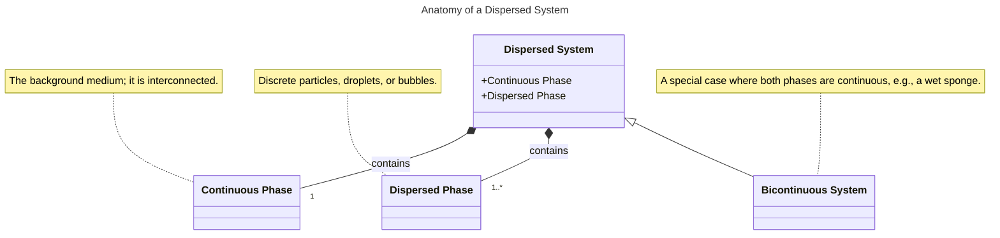
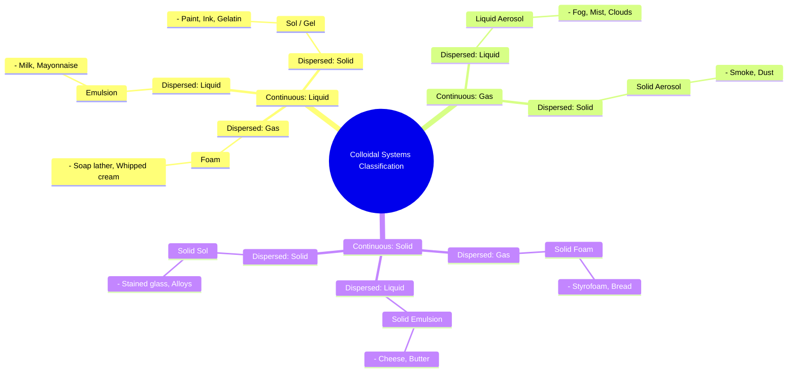
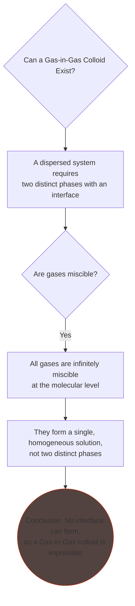
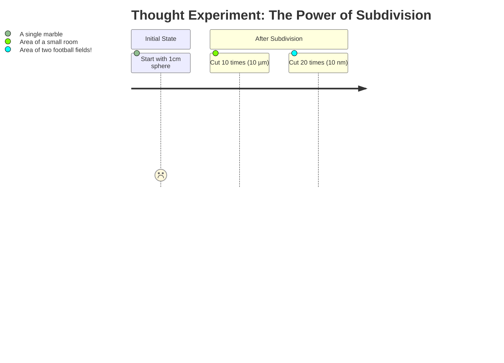

# Lecture 3: Classifying Dispersed Systems and Their Thermodynamic Foundation

<!-- prettier-ignore -->
!!! abstract "Key Concepts Introduced"
    This lecture establishes the fundamental structure of all colloidal and dispersed systems by defining the **continuous** and **dispersed** phases. We will systematically classify different types of colloids based on the state of matter of their components (e.g., foams, emulsions, aerosols). We will then perform a thought experiment to demonstrate the colossal increase in **interfacial area** in colloidal systems. Finally, we will connect this physical reality to its thermodynamic underpinnings by revisiting the **Gibbs Phase Rule**, establishing the critical link between phase equilibria and the stability of colloidal products.

---

## 1. The Anatomy of a Dispersed System

All colloidal systems are a subset of a broader category known as **dispersed systems**. This implies that one substance is distributed, in a finely divided state, within another. This structure gives rise to two fundamental components:

- **Continuous Phase:** This is the background medium in which the other phase is scattered. A key characteristic is its connectivity; it is theoretically possible to trace a continuous path from one end of the sample to the other entirely within this phase, without crossing into the other.

- **Dispersed Phase:** This consists of the discrete particles, droplets, or bubbles that are distributed throughout the continuous phase. There is no connectivity between individual particles of the dispersed phase; to get from one particle to another, one must travel through the continuous phase.

<!-- prettier-ignore -->
!!! tip "A Special Case: Bicontinuous Systems"
    It is possible to have systems where **both** phases are interconnected and continuous throughout the sample. A classic example is a porous sponge saturated with water. One can trace a path through the solid sponge material from end to end, and one can also trace a path through the interconnected water-filled pores. These are known as **bicontinuous dispersed systems**.

---

## 2. A Universe of Scales: Visualizing and Separating Dispersed Systems

Dispersed systems exist across an immense range of sizes, from the atomic to the astronomical. Colloids occupy a specific, crucial window within this spectrum.

#### The Scale of Things:

- **Atomic & Molecular (< 1 nm):** Individual atoms, ions, small molecules (e.g., glucose).
- **Nanostructures & Colloids (1 nm - 1 µm):** Proteins, viruses, smoke particles, paint pigments, milk fat globules. This is the primary domain of our course.
- **Particulates (> 1 µm):** Bacteria, red blood cells, pollen, sand grains.

#### Tools for Observation and Separation:

A vast amount of information about dispersed systems is captured in their interaction with analytical tools and processes.

| Scale (approx.) | Visualization Tools              | Interaction with Light        | Separation Process           |
| :-------------- | :------------------------------- | :---------------------------- | :--------------------------- |
| **> 1 µm**      | Naked Eye, Optical Microscope    | Light Diffusion               | Gravity, Particle Filtration |
| **1 nm - 1 µm** | Electron Microscope, AFM         | Tyndall & Rayleigh Scattering | Micro/Ultra/Nanofiltration   |
| **< 1 nm**      | Indirect (e.g., Particle Accel.) | (Molecular interactions)      | Osmosis, Reverse Osmosis     |

**Real-World Light Scattering:** We constantly observe the interaction of light with natural colloids.

- **Sunbeams:** The visible shafts of sunlight streaming through a forest canopy are made visible by the light scattering off colloidal dust and moisture particles in the air (**Tyndall effect**).
- **Eye Color:** The blue, green, or hazel color of the human iris is not due to pigment but is a **structural color** caused by Rayleigh scattering of light from the nano-scale fibrous structures within the iris.

---

## 3. A Systematic Classification of Colloidal Systems

Colloidal systems are given specific names based on the physical state (solid, liquid, or gas) of their dispersed and continuous phases. This classification provides a powerful framework for understanding their properties.

| Dispersed Phase | Continuous Phase | Name of Colloid               | Everyday Examples                                 |
| :-------------- | :--------------- | :---------------------------- | :------------------------------------------------ |
| Gas             | Liquid           | **Foam**                      | Soap lather, whipped cream, beer head             |
| Liquid          | Liquid           | **Emulsion**                  | Milk, mayonnaise, salad dressing, lotions         |
| Solid           | Liquid           | **Sol / Suspension / Gel**    | Paint, ink, muddy water, gelatin                  |
| Liquid          | Gas              | **Liquid Aerosol**            | Fog, mist, clouds, hair spray                     |
| Solid           | Gas              | **Solid Aerosol / Smoke**     | Smoke, dust in the air, smog                      |
| Gas             | Solid            | **Solid Foam / Sponge**       | Styrofoam, pumice stone, bread                    |
| Liquid          | Solid            | **Solid Emulsion / Gel**      | Cheese, butter, jelly                             |
| Solid           | Solid            | **Solid Sol / Blend / Alloy** | Stained glass, some alloys (e.g., carbon in iron) |

<!-- prettier-ignore -->
???+ question "Thought-Provoking Question: The Missing Colloid"
    **Question:** The table covers 8 of the 9 possible combinations of states of matter. Why is there no entry for a **gas dispersed in a gas**?

    **Answer:** The answer lies in a fundamental thermodynamic principle: **all gases are infinitely miscible with one another.** To form a dispersed system, you must have two distinct phases separated by an interface. Since any two gases will mix at the molecular level to form a single, homogeneous solution, it is impossible to form discrete "droplets" or "particles" of one gas within another. While a mixture of gases can be separated by external fields (like a centrifuge separating uranium isotopes), they will never spontaneously form two distinct phases.

---

## 4. The Power of Subdivision: Why Interfacial Area Dominates

A defining characteristic of colloidal systems is their **enormous interfacial surface area** relative to their volume. This is why the properties of the _interface_ often become more important than the properties of the _bulk_ material.

Let's consider a simple thought experiment:
Start with a single sphere of water with a radius ($r$) of 1 cm. Let's repeatedly "cut" it so that at each step, the radius is halved. Since volume is conserved, each cut will produce 8 new spheres.

- **Volume of a sphere:** $V = \frac{4}{3}\pi r^3$
- **Surface area of a sphere:** $A = 4\pi r^2$

| Cut Number (n) | Radius (cm)     | Number of Spheres | Total Surface Area (cm²)      | Analogy                          |
| :------------- | :-------------- | :---------------- | :---------------------------- | :------------------------------- |
| 0              | 1               | 1                 | 12.6                          | A single marble                  |
| 1              | 0.5             | 8                 | 25.1                          | (Area doubles)                   |
| 10             | ~10 µm          | 10⁹ (1 billion)   | 12,600                        | Area of a small room             |
| **20**         | **~10 nm**      | **10¹⁸**          | **12,600,000 (12.6 million)** | **Area of two football fields!** |
| 30             | ~10 pm (atomic) | 10²⁷              | 1.26 x 10¹⁰                   | (Physical limit reached)         |

<!-- prettier-ignore -->
!!! abstract "Section Summary: The Takeaway on Surface Area"
    By subdividing a marble-sized sphere of material down to the colloidal scale (10 nm particles), its total surface area increases **a million-fold**. This colossal area means that a huge fraction of the system's molecules are now at an interface, and the energy associated with this interface will dominate the system's overall behavior.

---

## 5. Thermodynamic Stability: The Gibbs Phase Rule

The most critical concept to remember is that **all colloidal systems are, by definition, multi-phase systems.** Their existence and stability are therefore governed by the laws of thermodynamics, specifically phase equilibria. The cornerstone for understanding this is the **Gibbs Phase Rule**.

The Gibbs Phase Rule is an equation that relates the number of controllable variables (degrees of freedom) in a system at equilibrium to the number of components and phases present.

$$
F = C - P + 2
$$

- $F$ : **Degrees of Freedom**. This is the number of intensive variables (like Temperature, Pressure, or Composition) that can be changed _independently_ without changing the number of phases in the system.
- $C$ : **Number of Components**. This is the minimum number of independent chemical species needed to define the composition of all phases in the system.
- $P$ : **Number of Phases**. A phase is a region of space where all physical properties are uniform. A colloid has at least P=2.
- The number `2` represents the two common intensive variables: Temperature and Pressure.

#### Application to a Single-Component System (like Water, where C=1):

- **If P=1 (one phase, e.g., all liquid):**
  $F = 1 - 1 + 2 = 2$.
  We have **two degrees of freedom**. We can independently change both Temperature and Pressure over a wide range and still have a single phase. This corresponds to the areas on a phase diagram.

- **If P=2 (two phases, e.g., ice and liquid water):**
  $F = 1 - 2 + 2 = 1$.
  We have only **one degree of freedom**. If we set the Pressure, the Temperature at which ice and water coexist is automatically fixed. We can only move along the coexistence lines on a phase diagram.

- **If P=3 (three phases, e.g., ice, water, vapor):**
  $F = 1 - 3 + 2 = 0$.
  We have **zero degrees of freedom**. There is only one specific combination of Temperature and Pressure (the triple point) where all three phases can coexist.

<!-- prettier-ignore -->
!!! warning "The Consequence for Real-World Products"
    This rule has immense practical importance. A cosmetic lotion or toothpaste is a carefully formulated multi-phase colloidal system. If its composition and storage conditions (temperature, pressure) are not carefully controlled to stay within a stable region ($F>0$), the system can hit a phase boundary. This causes **phase separation**—the oily liquid separating from the paste in toothpaste, for example—rendering the product useless. Ensuring colloidal stability is a constant challenge for chemical engineers in the consumer goods industry.

---

## 🧠 Proposed Exam Questions

1.  Using the formal classification system, identify the type of colloid for each of the following: (a) Mayonnaise, (b) Styrofoam, and (c) Fog. For each, state the dispersed and continuous phase.
2.  A 1 cubic centimeter cube of a solid is ground down into smaller cubic particles, each with a side length of 100 nm. Calculate the total surface area of the resulting powder. How many orders of magnitude has the surface area increased compared to the original cube?
3.  According to the Gibbs Phase Rule, what is the maximum number of phases that can coexist at equilibrium for a single-component system? For a two-component system? Explain your reasoning.

---

## 📖 Glossary of New Terms

- **Bicontinuous System:** A dispersed system in which both phases form a continuous, interconnected network throughout the material.
- **Continuous Phase:** The medium in which a dispersed phase is distributed.
- **Dispersed Phase:** The substance that is distributed as discrete particles, droplets, or bubbles within the continuous phase.
- **Gibbs Phase Rule:** A thermodynamic rule that describes the number of independent variables (degrees of freedom) that can be varied in a system at equilibrium.
- **Degrees of Freedom (F):** The number of intensive properties (like T, P) that can be varied independently without altering the number of phases.
- **Tyndall Effect:** The scattering of light by particles in a colloid or very fine suspension, making the beam of light visible.

---

## 📊 Concept Map

### 1. Anatomy of a Dispersed System (Class Diagram)

A `classDiagram` is used here to show the composition of a "Dispersed System" and to illustrate that a "Bicontinuous System" is a specialized type of dispersed system. Using backticks allows for class names with spaces.

### 2. Systematic Classification of Colloids (Mindmap)

A `mindmap` is perfect for showing the hierarchical classification of colloids based on the states of matter of their continuous and dispersed phases.

### 3. The "Missing Colloid" Logic (Flowchart)

This flowchart visualizes the logical reasoning for why a Gas-in-Gas colloid cannot exist, as explained in the lecture.

### 4. Surface Area Explosion (User Journey)

A `journey` diagram illustrates the progression of the thought experiment, showing the dramatic increase in surface area as a particle is subdivided down to the colloidal scale.

### 5. Applying the Gibbs Phase Rule (Flowchart)

This flowchart demonstrates how the Gibbs Phase Rule is applied to a single-component system (like water) to determine the degrees of freedom based on the number of coexisting phases.

```mermaid
flowchart TD
    subgraph "Applying the Gibbs Phase Rule"
        A["<b>Formula:</b> F = C - P + 2<br>For Water, C=1"] --> B{"How many phases (P) coexist?"}
        B -- "P=1 (e.g., Liquid)" --> C["F = 1 - 1 + 2 = 2<br><b>Result:</b> 2 Degrees of Freedom<br>(Can vary T and P independently)"]
        B -- "P=2 (e.g., Liquid/Ice)" --> D["F = 1 - 2 + 2 = 1<br><b>Result:</b> 1 Degree of Freedom<br>(T is fixed if P is set)"]
        B -- "P=3 (e.g., Triple Point)" --> E["F = 1 - 3 + 2 = 0<br><b>Result:</b> 0 Degrees of Freedom<br>(T and P are fixed)"]
    end

    style C fill:#384d43,stroke:#006644
    style D fill:#414853,stroke:#0747A6
    style E fill:#3e4858,stroke:#0747A6
```

