# Lecture 4: Colloidal Stability and Interaction Energy

<!-- prettier-ignore -->
!!! abstract "Key Concepts Introduced"
    This lecture moves from defining colloids to the central challenge of their existence: **stability**. We will explore why creating and maintaining a dispersion requires energy and introduce the master tool for understanding stability: the **interaction energy curve**. We will dissect this curve to understand coagulation, kinetic stability, and the critical role of the energy barrier. We will also classify colloids based on their affinity for the medium and introduce the fascinating, self-assembling world of **association colloids**.

---

## Watch here

## 1. Review and Prerequisite: The Gibbs Phase Rule

As we established, a fundamental prerequisite for any colloidal system is the presence of **at least two distinct phases**. The stability and existence of these phases under different conditions (Temperature, Pressure, Composition) are governed by the **Gibbs Phase Rule**.

For a non-reacting system (where the number of reactions, $r$, is 0), the rule is:

$$
F = C - P + 2
$$

Where:

- $F$: Degrees of Freedom (number of variables you can change independently)
- $C$: Number of Components (chemical species)
- $P$: Number of Phases (must be $\ge 2$ for a colloid)

A stable colloidal product, like a cosmetic lotion, must be formulated to exist in a region with sufficient degrees of freedom ($F \ge 1$) to avoid accidental phase separation during storage or use.

---

## 2. Creating a Dispersion: An Uphill Energy Battle

When two immiscible phases are mixed, they can separate under the influence of an external field like gravity.

- The lighter phase rises to the top in a process called **creaming**.
- The denser phase sinks to the bottom in a process called **sedimentation**.

To create a fine dispersion (a colloid) from these separated bulk phases, we must input a significant amount of energy, typically through mechanical mixing.

<!-- prettier-ignore -->
???+ question "Why is energy required to create a dispersion?"
    **Question:** If I stir a single-phase liquid like pure water, the energy I put in is eventually lost as heat due to viscous dissipation. When I stir two immiscible liquids to form a colloid, what is the primary difference? Where does the energy go?

    **Answer:** The key difference is the creation of a vast amount of new **interfacial area**. As we saw in the last lecture, subdividing a bulk material into colloidal particles increases its surface area by millions of times. Every square meter of this new interface has an associated energy, known as **interfacial tension**. The energy input from the mixer must be sufficient to overcome this interfacial energy. Therefore, the primary purpose of the energy is not just to move the fluid, but to do the thermodynamic work of creating the high-energy interface between the two phases. Making this process energy-efficient is a major challenge in chemical engineering.

---

## 3. The Core of Stability: The Interaction Energy Curve

Once a dispersion is formed, the crucial question is: will it stay dispersed, or will the particles clump together? The process of particles sticking together is called **coagulation**. This is governed by the forces between the particles.

We can understand this by plotting the **potential energy of interaction** between two particles as a function of the distance separating them. This plot is the single most important concept for understanding colloidal stability.

 <!-- Placeholder for a visual representation of the energy curve -->

Let's dissect this crucial diagram:

- **Y-Axis:** The potential energy ($V$) of the two-particle system, often non-dimensionalized by dividing by $k_B T$, the characteristic thermal energy of a particle.
- **X-Axis:** The center-to-center separation distance ($r$) between the two particles.

#### Key Features of the Curve:

1.  **Primary Minimum (Deep Well):** At very short distances, there is a very deep, strong attractive well. If particles fall into this well, they are irreversibly stuck together. This represents the **coagulated state**. The system is trying to minimize its overall energy by eliminating the high-energy solid-liquid interface.

2.  **Energy Barrier ($\Delta E_c$):** At intermediate distances, there is often a repulsive energy "hill" or barrier. This barrier is the key to stability. Particles must gain enough energy to overcome this hill to fall into the primary minimum.

3.  **Secondary Minimum (Shallow Well):** At larger distances, there may be a weak, shallow attractive well. This represents a state where particles are loosely held near each other but are not strongly stuck. This can lead to a phenomenon called flocculation, a reversible form of aggregation.

4.  **Infinite Repulsion:** At extremely short distances, the energy rises vertically. This represents the hard-core repulsion when the electron clouds of the atoms on the particle surfaces start to overlap. You cannot push the particles through each other.

#### The Decisive Role of the Energy Barrier

The stability of the colloid is a competition between the **thermal energy** of the particles and the **height of the energy barrier**.

- The particles in the dispersion are constantly moving due to Brownian motion, with a characteristic kinetic energy of the order of **$k_B T$**.
- **If $\Delta E_c \gg k_B T$**: The energy barrier is much higher than the typical thermal energy of the particles. It is statistically very unlikely that a particle will have enough energy to jump over the barrier. The particles are kinetically trapped in a dispersed state. This is a **kinetically stable colloid**.
- **If $\Delta E_c \approx k_B T$ or less**: The energy barrier is low. Particles have enough thermal energy to easily overcome it. They will rapidly fall into the primary minimum and coagulate. This is an **unstable colloid**.

<!-- prettier-ignore -->
!!! warning "Kinetic vs. Thermodynamic Stability"
    A "stable" colloid is almost always only **kinetically stable** (or metastable). The true, lowest-energy **thermodynamically stable** state is complete phase separation (i.e., all particles coagulated into a single bulk mass). Our goal in making a colloid is to create a large enough energy barrier ($\Delta E_c$) to trap the system in its dispersed, metastable state for a useful amount of time.

---

## 4. Classifying Colloids by Nature and Affinity

Beyond their physical state, colloids can be classified based on their formation and interaction with the continuous phase.

| Category        | Description                                                                                                                                                  | Stability Mechanism                                                                  | Example                                             |
| :-------------- | :----------------------------------------------------------------------------------------------------------------------------------------------------------- | :----------------------------------------------------------------------------------- | :-------------------------------------------------- |
| **Intrinsic**   | Form spontaneously with little or no energy input. The colloidal state is often the thermodynamically stable state.                                          | The molecules themselves are designed to self-assemble.                              | **Association Colloids** (like micelles)            |
| **Extrinsic**   | Require significant energy input to form and often need a stabilizing agent to prevent coagulation. This describes the vast majority of engineered colloids. | An energy barrier ($\Delta E_c$) must be artificially created.                       | Paint (pigment in solvent), homogenized milk        |
| **Hydrophilic** | "Water-loving." The dispersed particles have a strong affinity for a water-based continuous phase. Also called emulsoids.                                    | Often stabilized by layers of water molecules and repulsive forces.                  | Proteins in water, gelatin                          |
| **Hydrophobic** | "Water-fearing." The dispersed particles have a low affinity for water. Also called lyophobic, suspensioids. They require stabilization to exist in water.   | Relies almost entirely on creating an energy barrier (e.g., through surface charge). | Gold nanoparticles in water, oil-in-water emulsions |

### A Special Case: Association Colloids & Micelles

**Association colloids** are a remarkable class of intrinsic colloids that form spontaneously. They are made from **surfactant** (surface-active agent) molecules. A common example is soap.

- **Structure of a Surfactant:** These molecules are **amphiphilic**, meaning they have two distinct parts:
  - A hydrophilic "head" that loves water.
  - A hydrophobic "tail" (oily part) that hates water.
- **Self-Assembly:** When placed in water above a certain concentration (the **Critical Micelle Concentration, CMC**), these molecules spontaneously self-assemble to minimize the unfavorable contact between their oily tails and the water. They form spherical structures called **micelles**, with the oily tails hidden in the core and the water-loving heads forming the outer shell.
- **Spontaneous Formation:** This is like throwing a pile of bricks into the air and having them spontaneously form a building. This self-assembly is a powerful principle used throughout nature and technology. At higher concentrations, they can form more complex structures like sheets (lamellar micelles).

---

## 5. Characterizing Colloidal Particles

To understand and control a colloidal system, we need to measure the properties of the dispersed particles. Key characteristics include:

- **Geometric Properties:**
  - **Size:** The defining feature, typically a diameter or radius.
  - **Shape:** Can be spherical, cylindrical (rod-like), disc-like, or irregular.
  - **Arrangement:** How particles are positioned relative to each other (e.g., forming a crystal-like lattice).
  - **Orientation & Alignment:** For non-spherical particles, do their axes point in the same direction? (Crucial for liquid crystal displays).
- **Electrical Properties:**
  - **Particle Charge:** Particles often acquire a surface charge, which is a major source of repulsion and stability.
- **Population Properties:**
  - **Monodisperse:** All particles are identical in size and shape.
  - **Polydisperse:** There is a distribution of sizes and/or shapes.
  - **Composition:** Are all particles made of the same material, or is it a mixture?

#### Describing Irregular Particles

Real-world particles are rarely perfect spheres. We often use an **equivalent diameter** to describe their size, which approximates the irregular shape to a regular one based on a specific property. Examples include:

- **Projected Area Diameter:** The diameter of a circle with the same area as the particle's 2D projection.
- **Feret's Diameter:** The maximum distance between two parallel lines tangent to the particle's outline (like measuring with a caliper at all possible angles and taking the maximum reading).

---

## 6. A Quantitative Look: The Lennard-Jones Potential

The complex shape of the interaction energy curve arises from the sum of attractive and repulsive forces. A classic model for the interaction between two neutral atoms or molecules is the **Lennard-Jones 6-12 potential**.

$$
V(r) = 4\epsilon \left[ \left(\frac{\sigma}{r}\right)^{12} - \left(\frac{\sigma}{r}\right)^{6} \right]
$$

- $V(r)$ is the potential energy as a function of separation $r$.
- The **$r^{-12}$ term** is a strong, short-range **repulsive** force. It models the hard-core repulsion when electron clouds overlap.
- The **$r^{-6}$ term** is a weaker, longer-range **attractive** force (the Van der Waals or dispersion force).

This simple model produces a curve with a single attractive well (a primary minimum) and is a good starting point. However, it **lacks the repulsive energy barrier** needed to explain kinetic stability in colloids. In upcoming lectures, we will see how adding other forces (like electrostatic repulsion) to this basic picture creates the crucial energy barrier.

---

## 📖 Glossary of New Terms

- **Coagulation:** The irreversible process where colloidal particles aggregate into larger clusters due to strong attractive forces, leading to phase separation.
- **Creaming:** The rising of the less dense phase of an emulsion to the surface.
- **Equivalent Diameter:** A measure used to describe the size of an irregular particle by relating one of its properties (e.g., projected area) to that of a regular shape (e.g., a sphere).
- **Hydrophilic:** "Water-loving"; having an affinity to be wetted by or dissolved in water.
- **Hydrophobic:** "Water-fearing"; tending to repel or fail to mix with water.
- **Interaction Energy Curve:** A plot of the potential energy between two particles as a function of their separation distance. It is the primary tool for analyzing colloidal stability.
- **Intrinsic Colloid:** A colloid that forms spontaneously, where the dispersed state is thermodynamically favorable.
- **Extrinsic Colloid:** A colloid that requires energy input to form and stabilization to persist.
- **Lennard-Jones Potential:** A mathematical model that describes the potential energy of interaction between two non-bonding atoms or molecules.
- **Micelle:** An aggregate of surfactant molecules dispersed in a liquid, forming a colloidal suspension.
- **Sedimentation:** The settling of the denser phase of a suspension to the bottom due to gravity.
- **Surfactant:** A compound that lowers the surface tension between two liquids, a gas and a liquid, or a liquid and a solid.

---

## 📊 Concept Map

### 1. Colloidal Stability Decision Process (Flowchart)

This flowchart visualizes the core logic of kinetic stability. It shows the competition between the repulsive energy barrier and the thermal energy of the particles, which determines whether a colloid will be stable or coagulate.

```mermaid
flowchart TD
    subgraph "Stability of a Dispersed Colloid"
        A[Start: Dispersed Particles] --> B{"Energy Barrier (ΔEc) vs. Thermal Energy (kBT)"}
        B -- "ΔEc >> kBT" --> C[Kinetically Stable Colloid]
        B -- "ΔEc ≈ kBT" --> D[Unstable Colloid]

        C --> E["Particles are kinetically trapped.<br>Dispersion is stable for a useful time."]
        D --> F["Particles overcome the barrier<br>and fall into the primary minimum."]
        F --> G([Coagulation!])
    end
```

### 2. Classification of Colloids (Mindmap)

A mindmap is perfect for showing the different ways colloids are classified—by their formation method and their affinity for the surrounding medium.

### 3. Micelle Self-Assembly Process (State Diagram)

A state diagram effectively illustrates the spontaneous transition that surfactant molecules undergo when their concentration crosses a critical threshold (the CMC).

### 4. Key Features of the Interaction Energy Curve (User Journey)

A `journey` diagram can represent the "journey" of one particle approaching another, highlighting the different energy regions it encounters along the way as described by the interaction energy curve.

### 5. Components of the Lennard-Jones Potential (Requirement Diagram)

A `requirementDiagram` is a unique way to break down the components of the Lennard-Jones potential formula, treating each term as a requirement for the overall model.

```mermaid
requirementDiagram
    element Model {
        type: "Lennard-Jones 6-12 Potential"
        docRef: "V(r) = 4ε [ (σ/r)^12 - (σ/r)^6 ]"
    }

    requirement RepulsiveTerm {
        id: 1
        text: "Models hard-core repulsion from electron cloud overlap. This is verified by its dominance at very short distances."
        risk: High
        verifymethod: Analysis
    }

    requirement AttractiveTerm {
        id: 2
        text: "Models long-range Van der Waals attraction. This is verified by its dominance at larger distances."
        risk: Medium
        verifymethod: Analysis
    }

    Model - contains -> RepulsiveTerm
    Model - contains -> AttractiveTerm
```

