# Lecture 5: The Origin of Interparticle Forces

<!-- prettier-ignore -->
!!! abstract "Key Concepts Introduced"
    This lecture dives deep into the fundamental origins of the forces that govern colloidal stability. We will systematically dissect the various types of interactions that can occur between two particles, ranging from strong electrostatic forces to the more subtle Van der Waals forces. We will pay close attention to how the **energy of interaction depends on the separation distance** for each force type. The goal is to build a complete physical picture of the attractive and repulsive terms that combine to create the overall interaction energy curve.

---

## 1. From Theory to Measurement

Before cataloging the forces, it's crucial to understand that these interaction energy curves are not purely theoretical constructs. They can be, and are, measured experimentally.

<!-- prettier-ignore -->
???+ question "How can you measure the tiny forces between colloidal particles?"
    **Question:** The forces involved are incredibly small, and the distances are on the nanometer scale. How is it experimentally possible to measure them?

    **Answer:** While challenging, this is a cornerstone of modern surface science. Techniques like the **Surface Force Apparatus (SFA)** and **Atomic Force Microscopy (AFM)** are designed for this exact purpose. The general principle involves mounting one surface (or particle) onto an extremely sensitive cantilever (like a tiny diving board or spring). Another surface is brought progressively closer. The minuscule attractive or repulsive forces between the surfaces cause the cantilever to bend. By measuring this microscopic deflection (often with a laser), one can calculate the force at each separation distance. Integrating this force over distance then yields the potential energy curve we have been discussing.

---

## 2. A Catalog of Interparticle Interactions

The total interaction between two particles is the sum of several distinct contributions. The nature and strength of these forces depend on the electrical properties of the particles themselves (whether they carry a net charge, have a permanent dipole, etc.).

Let's examine these forces systematically, focusing on their dependence on the separation distance, $x$.

<!-- prettier-ignore -->
=== "1. Ion-Ion (Coulombic)"
    - **Description:** The direct electrostatic interaction between two particles that have a permanent, net electrical charge ($Z_1$ and $Z_2$). This is the strongest and longest-ranged of all the interactions.
    - **Nature:** Can be **repulsive** (if charges are alike) or **attractive** (if charges are opposite).
    - **Distance Dependence:** $V(x) \propto x^{-1}$
    - **Key Takeaway:** The slow $1/x$ decay means this force is significant even at large separations compared to other forces.

<!-- prettier-ignore -->
=== "2. Ion-Permanent Dipole"
    - **Description:** Interaction between a charged particle (ion) and a neutral particle that has a permanent dipole moment ($\mu$). A water molecule is a classic example of a permanent dipole.
    - **Nature:** Can be attractive or repulsive, depending on the **angular orientation ($\theta$)** of the dipole relative to the ion.
    - **Distance Dependence:** $V(x) \propto x^{-2}$
    - **Key Takeaway:** The interaction is maximized when the dipole is aligned with the electric field of the ion. In many systems, thermal energy causes random orientations, so we often work with an averaged energy.

<!-- prettier-ignore -->
=== "3. Permanent Dipole-Permanent Dipole (Keesom)"
    - **Description:** Interaction between two neutral molecules that both possess permanent dipoles ($\mu_1$ and $\mu_2$).
    - **Nature:** Highly dependent on the mutual orientation of the two dipoles.
    - **Distance Dependence:** For fixed dipoles, $V(x) \propto x^{-3}$. When averaged over all random thermal orientations, it becomes an **attractive** force with a dependence of $V(x) \propto x^{-6}$.
    - **Key Takeaway:** This is the first of the three classic **Van der Waals forces**.

<!-- prettier-ignore -->
=== "4. Permanent Dipole-Induced Dipole (Debye)"
    - **Description:** Interaction between a molecule with a permanent dipole and a neutral, nonpolar molecule. The electric field from the permanent dipole **induces** a temporary dipole in the second molecule.
    - **Nature:** **Always attractive.** The induced dipole will always orient itself favorably to the permanent dipole.
    - **Distance Dependence:** $V(x) \propto x^{-6}$
    - **Key Takeaway:** This is the second Van der Waals force. Its strength depends on the **polarizability ($\alpha$)** of the second molecule—a measure of how easily its electron cloud can be distorted.

<!-- prettier-ignore -->
=== "5. Induced Dipole-Induced Dipole (London Dispersion)"
    - **Description:** Interaction between two perfectly neutral, nonpolar molecules. At any given instant, the random movement of electrons creates a temporary, fluctuating dipole in one molecule. This fleeting dipole induces a synchronized dipole in the neighboring molecule.
    - **Nature:** **Always attractive.**
    - **Distance Dependence:** $V(x) \propto x^{-6}$
    - **Key Takeaway:** This is the third, and often most important, Van der Waals force. It exists between **all** atoms and molecules, regardless of their polarity, and is the reason noble gases can be liquefied.

<!-- prettier-ignore -->
=== "6. Hard-Core Repulsion"
    - **Description:** This is not an electrostatic force but a consequence of the Pauli Exclusion Principle. When two particles get so close that their electron clouds begin to overlap, a massive repulsive force arises, preventing them from occupying the same space.
    - **Nature:** **Always repulsive.**
    - **Distance Dependence:** Modeled with a very steep dependence, typically $V(x) \propto x^{-12}$ in the Lennard-Jones potential, though the actual exponent can vary from 9 to 15.
    - **Key Takeaway:** This force only becomes significant at very short distances and is responsible for the "hard wall" on the left side of the interaction energy curve.

### The Power of Alignment

For interactions involving dipoles, orientation is critical. In many cases, we assume random orientation and use a thermal average. However, it's possible to externally align molecules and dramatically change the material's properties.

- **Shear Alignment:** Forcing a liquid containing rod-like molecules to flow will cause them to align with the direction of flow, like logs in a river.
- **Electric/Magnetic Field Alignment:** Applying an external field can align molecules with permanent dipoles. This is the fundamental principle behind **Liquid Crystal Displays (LCDs)**, where applying a voltage aligns liquid crystal molecules, changing how they interact with polarized light to create an image.

---

## 3. Deriving the Debye Interaction: A Closer Look

To understand where the ubiquitous $x^{-6}$ dependence comes from, let's briefly walk through the logic for the Debye (permanent dipole-induced dipole) interaction.

1.  **Field of the Permanent Dipole:** A permanent dipole ($\mu_1$) creates an electric field ($E_1$) at a distance $x$. From basic electrostatics, the strength of this field is proportional to the dipole moment and falls off with distance: $E_1 \propto \frac{\mu_1}{x^3}$.

2.  **Inducing a Dipole:** This electric field $E_1$ acts on a second, nonpolar molecule. The ease with which a dipole is induced is given by the molecule's polarizability, $\alpha_2$. The magnitude of the induced dipole is $\mu_2 = \alpha_2 E_1$.

3.  **Energy of the Induced Dipole:** The potential energy of this newly created induced dipole ($\mu_2$) in the electric field ($E_1$) that created it can be shown to be $V = -\frac{1}{2}\alpha_2 E_1^2$. The factor of $1/2$ arises because energy is spent to create the dipole itself.

4.  **Putting It Together:** Now, substitute the expression for the electric field from Step 1 into the energy equation from Step 3:
    $V \propto -\frac{1}{2}\alpha_2 \left(\frac{\mu_1}{x^3}\right)^2 \propto -\frac{\alpha_2 \mu_1^2}{x^6}$.

This simple derivation reveals the physical origin of the **always attractive** (due to the negative sign) **$x^{-6}$ dependence** for the Debye interaction. Similar, though more complex, derivations yield the same distance dependence for the Keesom and London forces.

---

## 4. Synthesis: The Van der Waals Equation & the Lennard-Jones Potential

For interactions between two identical, uncharged particles, the total attractive energy is the sum of the London, Debye, and Keesom contributions. All of these share the $x^{-6}$ dependence. We can therefore lump them all together into a single attractive term.

The total interaction potential is the sum of this net attractive force and the hard-core repulsive force. This is precisely what the **Lennard-Jones potential** models:

$$
V(x) = \underbrace{C_{12} \cdot x^{-12}}_{\text{Repulsive Term}} - \underbrace{\beta_{11} \cdot x^{-6}}_{\text{Attractive Term}}
$$

- The **attractive part ($-\beta_{11} x^{-6}$)** represents the sum of all Van der Waals forces. The constant $\beta_{11}$ is the **Van der Waals interaction parameter** and contains all the information about dipole moments and polarizabilities.
- The **repulsive part ($C_{12} x^{-12}$)** is the empirical model for hard-core repulsion.

This equation gives the characteristic shape of the interaction curve for simple molecules: a single attractive well where the energy is at a minimum. This minimum represents the most stable separation distance.

<!-- prettier-ignore -->
!!! warning "The Missing Piece for Colloidal Stability"
    Crucially, the standard Lennard-Jones potential, which describes molecular interactions, **does not have the repulsive energy barrier ($\Delta E_c$)**. It only has a primary minimum. Therefore, if Van der Waals forces were the only forces acting between colloidal particles, every colloid would be unstable and would immediately coagulate. The existence of stable colloids proves that there must be another, longer-range **repulsive force** at play, which we have not yet considered. This force is what creates the energy barrier and is the subject of our upcoming lectures.

---

## 📖 Glossary of New Terms

- **Coulombic Interaction:** The electrostatic force of attraction or repulsion between two charged particles.
- **Dipole Moment ($\mu$):** A measure of the separation of positive and negative electrical charges within a system; a measure of the system's overall polarity.
- **Induced Dipole:** A temporary dipole moment created in a nonpolar molecule by the influence of a nearby charge or permanent dipole.
- **Permanent Dipole:** A dipole moment that is an intrinsic property of a molecule due to its asymmetric structure (e.g., water).
- **Polarizability ($\alpha$):** A measure of the ability of an electric field to distort the electron cloud of an atom or molecule, thereby inducing a dipole moment.
- **Van der Waals Forces:** A set of distance-dependent interactions between atoms or molecules. They include Keesom (permanent-permanent), Debye (permanent-induced), and London dispersion (induced-induced) forces. They are all weaker than ionic or covalent bonds.

---

## 📊 Concept Map

Of course. Based on the detailed transcript of Lecture 5, here are several diagrams created with Mermaid. Each diagram uses a different type to best visualize the specific concepts presented, without using any hardcoded colors.

### 1. Catalog of Interparticle Forces (Flowchart)

This flowchart organizes the different types of interparticle forces discussed, branching from the most general categories down to the specific types of Van der Waals forces.

```mermaid
flowchart TD
    subgraph "Catalog of Interparticle Forces"
        A[Total Interaction Energy] --> B{What kind of particles?}

        B -- "Both are Charged Ions" --> C["Ion-Ion (Coulombic)<br>V(x) ∝ x<sup>-1</sup>"]
        B -- "One Ion, One Dipole" --> D["Ion-Permanent Dipole<br>V(x) ∝ x<sup>-2</sup>"]
        B -- "Both are Neutral" --> E{Are they polar?}

        E -- "Yes, both have permanent dipoles" --> F["Dipole-Dipole (Keesom)<br>V(x) ∝ x<sup>-6</sup>"]
        E -- "One permanent, one nonpolar" --> G["Dipole-Induced Dipole (Debye)<br>V(x) ∝ x<sup>-6</sup>"]
        E -- "No, both are nonpolar" --> H["Induced-Induced (London)<br>V(x) ∝ x<sup>-6</sup>"]

        I["Hard-Core Repulsion<br>V(x) ∝ x<sup>-12</sup>"]
        A --> I
    end

    subgraph "Van der Waals Forces"
        F & G & H
    end
```

### 2. Derivation of the Debye Interaction (State Diagram)

A state diagram is used here to represent the step-by-step logical derivation of the Debye interaction's distance dependence, showing how each step leads to the next.

```mermaid
---
title: Derivation of Debye Interaction Energy
---
stateDiagram-v2
    direction TB

    [*] --> Step1
    state Step1 : Permanent dipole (μ1) creates an electric field (E1) at distance x.<br><b>E1 ∝ μ1 / x³</b>

    Step1 --> Step2
    state Step2 : The field E1 induces a temporary dipole (μ2) in a nonpolar molecule.<br><b>μ2 = α2 * E1</b>

    Step2 --> Step3
    state Step3 : The energy (V) of the induced dipole in the field is calculated.<br><b>V = -1/2 * α2 * E1²</b>

    Step3 --> Step4
    state Step4: Substitute E1 from Step 1 into the energy equation from Step 3.

    Step4 --> [*] : Conclude with Final Dependence<br><b>V ∝ - (α2 * μ1²) / x⁶</b>
```

### 3. Lennard-Jones Potential Synthesis (Requirement Diagram)

A `requirementDiagram` is a good way to deconstruct the Lennard-Jones potential, showing how it is built from two fundamental requirements: an attractive force and a repulsive force.

### 4. Overall Lecture Concept Map (Mindmap)

This mindmap provides a comprehensive overview of the entire lecture, connecting experimental measurement to the catalog of forces and the final synthesis in the Lennard-Jones model.

