# Lecture 6: Macroscopic Forces and Their Measurement

<!-- prettier-ignore -->
!!! abstract "Key Concepts Introduced"
    Building on our understanding of molecular-level forces, this lecture addresses a critical question: how do these tiny interactions scale up to govern the behavior of macroscopic particles and surfaces? We will develop a mathematical framework to sum up all the molecular Van der Waals interactions between two large bodies, leading to the derivation of the fundamentally important **Hamaker equation**. We will then explore the modern experimental techniques, such as the **Atomic Force Microscope (AFM)** and the **Surface Forces Apparatus (SFA)**, that allow us to directly measure these minute forces and validate our theoretical models.

---

## 1. From Molecules to Particles: Summing the Van der Waals Forces

In the last lecture, we established that for uncharged particles, the dominant attractive forces are the Van der Waals forces (Debye, Keesom, and London), all of which share a characteristic $x^{-6}$ dependence on distance. We can lump these contributions into a single equation for the attractive interaction energy between two _identical molecules_:

$$
V(x) = -\beta_{11} \cdot x^{-6}
$$

- The constant $\beta_{11}$ contains all the fundamental physical properties of the molecules (dipole moments, polarizabilities). It is always a positive value, ensuring the energy is always negative (attractive).

Our objective now is to scale this molecular-level interaction up to the level of macroscopic particles. The principle is straightforward, though the execution requires calculus: **the total interaction energy between two large particles is the sum (or integral) of the interactions between every molecule in the first particle and every molecule in the second particle.**

---

## 2. Geometric Scaling of Van der Waals Energy

Before diving into the full integration, we can prove a powerful scaling relationship. Consider two scenarios:

- **Case A:** Two identical spheres of radius $R_a$ are separated by a center-to-center distance $r_a$.
- **Case B:** Two identical spheres of radius $R_b$ are separated by a center-to-center distance $r_b$.

If Case B is a geometrically scaled version of Case A, such that $R_b = f \cdot R_a$ and $r_b = f \cdot r_a$ for some scaling factor $f$, what is the relationship between their interaction energies?

By setting up the volume integrals for both cases, we can show that the scaling factors cancel out perfectly. The differential energy is given by:

$$
d V_A = -\beta \left(\frac{N_A \rho}{M}\right)^2 \frac{dV_{A1} dV_{A2}}{x_A^6}
$$

When we scale this to Case B, the volume elements scale as $f^3$ ($dV_B = f^3 dV_A$) and the distance scales as $f$ ($x_B^6 = f^6 x_A^6$).

$$
d V_B \propto \frac{(f^3 dV_{A1}) (f^3 dV_{A2})}{(f \cdot x_A)^6} = \frac{f^6 dV_{A1} dV_{A2}}{f^6 x_A^6} = dV_A
$$

<!-- prettier-ignore -->
!!! abstract "The Scaling Principle"
    The total Van der Waals attractive energy between two bodies is **independent of scale**, provided that the geometry and the separation distance are scaled by the same factor. The energy of interaction between two 10 nm spheres separated by 20 nm is the same as the energy between two 10 cm spheres separated by 20 cm, if only Van der Waals forces are considered. This is a profound and non-intuitive result.

---

## 3. Derivation of the Hamaker Equation for Two Flat Plates

To quantify the interaction for a specific geometry, let's derive the energy between two semi-infinite flat blocks separated by a gap of distance $D$.

**Strategy:**

1.  Calculate the interaction energy between a single molecule in Block 2 and the entirety of Block 1.
2.  Integrate the result from Step 1 over all the molecules in Block 2.

**Step 1: Molecule-to-Block Interaction**

We place a molecule at a distance $Z$ from the surface of Block 1. To calculate the total energy, we integrate over Block 1 using cylindrical coordinates. A differential volume element in Block 1 is a ring of radius $y$ and thickness $dy$, at a depth $\zeta$ into the block.

 <!-- Placeholder for a diagram of the coordinate system -->

The total energy is the integral of the molecular interaction over this entire semi-infinite block:

$$
V_{\text{mol-block}}(Z) = - \int_{0}^{\infty} \int_{0}^{\infty} \beta \left(\frac{N_A \rho}{M}\right) \frac{2\pi y \, dy \, d\zeta}{x^6}
$$

where $x^2 = (Z+\zeta)^2 + y^2$. After performing the integration (first over $y$, then over $\zeta$), the result is surprisingly simple:

$$
V_{\text{mol-block}}(Z) = -\frac{\pi}{12} \beta \left(\frac{N_A \rho}{M}\right) Z^{-3}
$$

The interaction of a single molecule with a macroscopic block falls off as the cube of the distance.

**Step 2: Block-to-Block Interaction**

Now, we sum up the contributions from all molecules in Block 2. We consider a thin slice of Block 2 of thickness $dz$ at a distance $z$ from the interface of Block 1. All molecules in this slice are at approximately the same distance. We integrate this from the surface of Block 2 (where $z=D$) to infinity.

$$
V_{\text{block-block}}(D) = \int_{D}^{\infty} V_{\text{mol-block}}(z) \left(\frac{N_A \rho}{M}\right) dz
$$

Substituting our result from Step 1 and integrating gives the final result:

$$
V_{\text{block-block}}(D) = - \frac{A_{11}}{12\pi D^2}
$$

This is the celebrated **Hamaker Equation**.

- $A_{11}$ is the **Hamaker Constant**, a single parameter that lumps all the material properties together:
  $A_{11} = \pi^2 \beta_{11} \left(\frac{N_A \rho}{M}\right)^2$.
- The equation shows that the attractive Van der Waals energy between two macroscopic flat surfaces falls off as **the inverse square of the separation distance ($D^{-2}$)**. This is a much longer-range interaction than the $x^{-6}$ molecular interaction it originates from.

<!-- prettier-ignore -->
!!! note "Order of Magnitude"
    Based on fundamental properties (ionization potentials, densities), the Hamaker constant ($A$) for most materials is found to be on the order of **$10^{-20}$ to $10^{-19}$ Joules**. This may seem tiny, but when the separation $D$ is only a few nanometers, the resulting attractive energy can be substantial, on the order of millijoules per square meter.

---

## 4. Experimental Measurement of Macroscopic Forces

How do we confirm these theoretical predictions and measure the Hamaker constant for real materials? Two key instruments dominate this field.

#### The Atomic Force Microscope (AFM)

The AFM is a revolutionary tool capable of "feeling" a surface with atomic resolution.

- **Principle:** A sharp tip (often with a radius of just a few nanometers) is mounted on a flexible cantilever. A laser is bounced off the back of the cantilever onto a detector. As the tip is brought close to a sample surface, attractive or repulsive forces cause the cantilever to bend. This deflection is detected by the movement of the laser spot.
- **Force Measurement:** By knowing the spring constant of the cantilever, the measured deflection can be converted directly into the force between the tip and the surface. By recording this force as a function of the tip-surface separation, one can generate the interaction energy curve directly.
- **Imaging:** The AFM's primary use is as a microscope. By scanning the tip across the surface in the x-y plane and using a feedback loop to keep the force (or height) constant, the instrument can generate a three-dimensional topographical map of the surface, literally an image of the atoms.

#### The Surface Forces Apparatus (SFA)

The SFA is a specialized instrument designed purely for high-precision force measurement between macroscopic surfaces.

- **Principle:** It typically uses a geometry of two crossed cylinders, which is mathematically equivalent to a sphere near a flat plate. One cylinder is mounted on a sensitive spring. The distance between the cylinders is controlled with extreme precision using micrometers and piezoelectric translators.
- **Measurement:** As with the AFM, the force is determined by measuring the deflection of the spring. The SFA is capable of measuring forces with nano-Newton resolution and distances with sub-nanometer accuracy.
- **Jump-to-Contact:** A characteristic feature of SFA experiments is the "jump-to-contact." As the surfaces are brought closer, the attractive Van der Waals force increases. At a certain point, the gradient of the attractive force becomes steeper than the spring constant of the measuring spring. At this point, the system becomes unstable, and the surfaces will suddenly jump together into contact. This instability point provides a direct and accurate way to measure the forces.

<!-- prettier-ignore -->
!!! abstract "Section Summary: Theory Meets Experiment"
    The development of tools like the AFM and SFA has been transformative. They allow us to move beyond theory and directly measure the forces that govern the colloidal world. The excellent agreement between the forces measured by these instruments and the predictions of the Hamaker theory provides strong validation for our understanding of how microscopic molecular interactions scale up to determine macroscopic behavior.

---

## 📖 Glossary of New Terms

- **Atomic Force Microscope (AFM):** A very high-resolution type of scanning probe microscope, with demonstrated resolution on the order of fractions of a nanometer. It measures force between a sharp tip and a surface.
- **Hamaker Constant (A):** A coefficient that describes the strength of the Van der Waals interaction between two macroscopic bodies. It incorporates the material properties (density, polarizability, etc.) of the interacting substances.
- **Hamaker Equation:** A set of equations that describe the Van der Waals interaction energy between macroscopic bodies of various geometries (e.g., two spheres, a sphere and a plate).
- **Piezoelectric Translator:** A device made from a material that changes its shape when a voltage is applied. It is used in AFMs and SFAs to control distances with extremely high precision.
- **Scaling:** In this context, the process of determining how a physical property (like interaction energy) changes as the size of the system changes.
- **Surface Forces Apparatus (SFA):** An instrument used to measure the physical forces between two surfaces as they are brought into close proximity.

---

## 📊 Concept Map

Of course. Based on the detailed transcript of Lecture 6, here are several diagrams created with Mermaid. Each diagram uses a different type to best visualize the specific concepts presented, without using any hardcoded colors.

### 1. Scaling Van der Waals Forces (Flowchart)

This flowchart illustrates the conceptual and mathematical process of scaling up from molecular interactions to macroscopic forces, culminating in the Hamaker equation.

```mermaid
flowchart TD
    subgraph "Scaling Van der Waals Forces: From Micro to Macro"
        A["<b>Start:</b> Two Molecules<br>Interaction Energy V(x) = -β * x<sup>-6</sup>"] --> B{Goal: Calculate force between two macroscopic bodies}
        B --> C["<b>Method:</b> Sum (integrate) the molecular interactions<br>over the volumes of both bodies"]

        C --> D{Derivation for Two Flat Plates}
        D --> E["Step 1: Integrate a single molecule<br>over the first block.<br><b>Result: V proportional to Z<sup>-3</sup></b>"]
        E --> F["Step 2: Integrate the molecule-block energy<br>over the second block.<br><b>Result: V proportional to D<sup>-2</sup></b>"]
        F --> G(["<b>Final Result:</b> Hamaker Equation<br>V(D) = -A / (12πD²)"])
    end
```

### 2. Experimental Measurement Techniques (Class Diagram)

A `classDiagram` is used to compare the two primary experimental techniques for measuring surface forces, highlighting their core principles and primary functions.

### 3. The Hamaker Constant (Mindmap)

This mindmap breaks down the concept of the Hamaker constant, showing what it represents, its typical value, and how it connects theory to experimental results.

### 4. The Geometric Scaling Principle (Requirement Diagram)

A `requirementDiagram` is used to logically structure the "Geometric Scaling Principle," defining the conditions and the surprising outcome.

### 5. Summary of Distance Dependencies (Block Diagram)

A `block` diagram provides a simple, clean visual summary of how the interaction energy's dependence on distance changes as the system scales up.

