# Lecture 7: Interfacial Energy, Cohesion, Adhesion, and Solidification

<!-- prettier-ignore -->
!!! abstract "Key Concepts Introduced"
    This lecture connects the microscopic world of Van der Waals forces to macroscopic, tangible properties. We will first extend the Hamaker equation to various practical geometries. Then, we will forge a crucial link between the **Hamaker constant** and **surface tension**, revealing them to be two sides of the same coin. This leads us to a thermodynamic analysis of **cohesion** (like-like interaction) and **adhesion** (unlike-unlike interaction) in the presence of an intervening medium. Finally, we will explore the profound implications of these adhesive/cohesive forces on the process of **solidification**, explaining why some mixtures form uniform solids while others phase-separate.

---

## 1. Extending the Hamaker Equation to Various Geometries

Last time, we derived the Hamaker equation for the attractive Van der Waals energy between two semi-infinite flat plates. By setting up the appropriate volume integrals and applying the correct limits, this approach can be extended to find analytical expressions for the interaction energy between bodies of many different shapes.

<!-- prettier-ignore -->
!!! note "For Reference Only"
    The following table provides the interaction energy for several common geometries. You are not expected to memorize these complex formulas (except for the original flat-plate equation), but you should appreciate how the energy dependence changes with the shape and separation of the objects.

| Interacting Bodies                     | Conditions                     | Interaction Energy, $V(D)$                                                                                              |
| :------------------------------------- | :----------------------------- | :---------------------------------------------------------------------------------------------------------------------- |
| Two spheres, radii $R_1, R_2$          | General                        | $-\frac{A}{6} \left[ \frac{2R_1R_2}{D(D+2R_1+2R_2)} + \frac{2R_1R_2}{(D+2R_1)(D+2R_2)} + \ln\left(\dots\right) \right]$ |
| Two identical spheres, radius $R$      | General                        | (Simplification of the above with $R_1=R_2=R$)                                                                          |
| **Two identical spheres, radius $R$**  | **$D \ll R$ (close approach)** | **$-\frac{A R}{12 D}$**                                                                                                 |
| A sphere (radius $R$) and a flat plate | $D \ll R$ (close approach)     | $-\frac{A R}{6 D}$                                                                                                      |
| Two flat plates of thickness $T$       | General                        | $-\frac{A}{12\pi} \left[ \frac{1}{D^2} + \frac{1}{(D+2T)^2} - \frac{2}{(D+T)^2} \right]$                                |
| **Two semi-infinite flat plates**      | **$T \to \infty$**             | **$-\frac{A}{12\pi D^2}$**                                                                                              |

The key takeaway is that for any given pair of materials (defined by their Hamaker constant, $A$), the attractive energy can be calculated for various geometries, which is essential for modeling real-world colloidal systems.

---

## 2. The Link Between Hamaker Constant and Surface Tension

Both the Hamaker constant and surface tension are manifestations of the same underlying intermolecular attractive forces. We can derive a direct relationship between them through a simple thought experiment.

**The Experiment:** Imagine a block of a single material (Phase 1). We perform work to cleave it in two, creating two new surfaces and separating them to an infinite distance.

1.  **From a Surface Energy Perspective:**

    - We start with zero new surface area.
    - We end by creating two new surfaces, each with an area we'll call one unit.
    - The energy required to create a new surface is, by definition, the surface tension, $\gamma_1$.
    - Therefore, the total work done (change in free energy) is:
      $\Delta E = 2 \gamma_1$ (per unit area).

2.  **From a Hamaker Force Perspective:**
    - We can model the "cleaving" process as taking two semi-infinite blocks that are initially in contact and pulling them apart.
    - "In contact" means they are separated by the equilibrium distance between molecules, $D_0$.
    - The work done is the integral of the force from $D_0$ to infinity, which is simply the negative of the interaction energy at $D_0$ (since the energy at infinity is zero).
    - Using the Hamaker equation, the energy change is:
      $\Delta E = E(\infty) - E(D_0) = 0 - \left(-\frac{A_{11}}{12\pi D_0^2}\right) = \frac{A_{11}}{12\pi D_0^2}$.

**Equating the two perspectives gives a profound result:**

$$
2 \gamma_1 = \frac{A_{11}}{12\pi D_0^2} \quad \implies \quad A_{11} = 24\pi \gamma_1 D_0^2
$$

<!-- prettier-ignore -->
!!! abstract "The Connection"
    The **Hamaker constant is directly proportional to the surface tension** of the material. This provides a powerful conceptual bridge: the microscopic parameter ($A$) that governs particle attraction is fundamentally linked to the macroscopic, measurable property of surface tension ($\gamma$).

---

## 3. Cohesion vs. Adhesion: The Role of an Intervening Medium

The simple Hamaker equation assumed the two bodies were interacting across a vacuum. In reality, colloidal interactions almost always occur across an intervening medium (e.g., water, air). This dramatically changes the energetics.

We can analyze the change in free energy ($\Delta E$) when two bodies are brought together.

- If $\Delta E < 0$, the process is spontaneous (favorable attraction).
- If $\Delta E > 0$, the process requires work (net repulsion).

#### Case A: Cohesion (Two identical bodies)

Consider two bodies of Material 2 brought together through a medium of Material 1.

- **Initial State:** Two `2-1` interfaces.
- **Final State:** One `2-2` interface (the bodies are joined) and one `1-1` interface (the excluded medium joins itself).
- **Energy Change:** $\Delta E = (E_{22} + E_{11}) - (E_{21} + E_{12})$

Using the Hamaker framework and a common approximation for the interaction between dissimilar materials ($A_{12} \approx \sqrt{A_{11}A_{22}}$), the effective Hamaker constant for this interaction becomes:

$$
A_{\text{effective}} = A_{212} = (\sqrt{A_{22}} - \sqrt{A_{11}})^2
$$

Since this is a squared term, **$A_{\text{effective}}$ is always positive**. This means that the cohesion of two identical bodies in a medium is **always an attractive, favorable process**. This is expected; a material exists because its molecules prefer to be with each other rather than flying apart.

#### Case B: Adhesion (Two dissimilar bodies)

Consider bringing a body of Material 2 and a body of Material 3 together through a medium of Material 1.

- **Initial State:** One `2-1` interface and one `3-1` interface.
- **Final State:** One `2-3` interface and one `1-1` interface.
- **Energy Change:** $\Delta E = (E_{23} + E_{11}) - (E_{21} + E_{31})$

The effective Hamaker constant in this case is:

$$
A_{\text{effective}} = A_{213} \approx (\sqrt{A_{22}} - \sqrt{A_{11}})(\sqrt{A_{33}} - \sqrt{A_{11}})
$$

<!-- prettier-ignore -->
!!! warning "The Sign Matters!"
    This term is **not** guaranteed to be positive. Its sign depends on the relative magnitudes of the Hamaker constants (or surface tensions) of the three materials.
    -   **If $A_{\text{effective}} > 0$:** The interaction is **attractive**. The two dissimilar materials prefer to adhere to each other rather than stay separated in the medium.
    -   **If $A_{\text{effective}} < 0$:** The interaction is **repulsive**. The materials prefer to be surrounded by the medium rather than sticking to each other. This is the origin of **steric stabilization** and explains why some materials are incompatible.

---

## 4. Implications for Solidification and Material Science

These principles of attraction and repulsion have profound consequences in materials science, particularly during solidification from a liquid melt containing a second, dispersed component (e.g., impurities, alloying elements, nanoparticles).

Consider a solid phase (white) growing into a liquid phase containing a dispersed component (black particles).

| Scenario                                       | Interaction                                 | Outcome                                                                                                                                                                                                                          |
| :--------------------------------------------- | :------------------------------------------ | :------------------------------------------------------------------------------------------------------------------------------------------------------------------------------------------------------------------------------- |
|     | **Repulsive** ($A_{\text{effective}} < 0$)  | **Pushing:** The growing solid front repels the black particles. As the solid advances, it pushes the particles ahead of it, concentrating them in the remaining liquid. This leads to phase separation.                         |
|  | **Repulsive** ($A_{\text{effective}} < 0$)  | **Entrapment:** If the solid grows in a complex, dendritic (tree-like) manner, the repelled particles can get cornered and trapped in pockets of liquid between the growing solid fingers. This leads to non-uniform inclusions. |
|  | **Attractive** ($A_{\text{effective}} > 0$) | **Engulfment:** The growing solid front is attractive to the black particles. As the front advances, it incorporates the particles, "engulfing" them and resulting in a uniform dispersion throughout the final solid material.  |

**Application: Creating Pure Crystals**
The "pushing" phenomenon is a critical mechanism for purification. In processes like zone refining for silicon purification, a molten zone is passed along a solid rod. Impurities are repelled by the solidifying silicon ($A_{\text{effective}} < 0$) and are "pushed" along with the molten zone, concentrating them at one end of the rod, which can then be cut off.

---

## 📖 Glossary of New Terms

- **Adhesion:** The process where two _dissimilar_ bodies are brought into contact, typically through an intervening medium. The interaction can be attractive or repulsive.
- **Cohesion:** The process where two _identical_ bodies are brought into contact through an intervening medium. The interaction is always attractive.
- **Engulfment:** During solidification, the process where the growing solid front incorporates dispersed particles due to an attractive interaction.
- **Entrapment:** During solidification, the process where repelled particles are mechanically trapped in the solid due to the complex geometry of the growing solid front.
- **Pushing:** During solidification, the process where the growing solid front repels dispersed particles due to a repulsive interaction, concentrating them in the liquid phase.
- **Raoult's Law:** A law of thermodynamics that states that the partial vapor pressure of each component of an ideal mixture of liquids is equal to the vapor pressure of the pure component multiplied by its mole fraction in the mixture.
- **Henry's Law:** A gas law that states that the amount of dissolved gas in a liquid is proportional to its partial pressure above the liquid.

---

## 📊 Concept Map

### 1. Extending the Hamaker Equation (Block Diagram)

A `block` diagram is a clean and simple way to summarize the different interaction energy formulas for various geometries, emphasizing how the distance dependence changes.

### 2. Linking Hamaker Constant to Surface Tension (Flowchart)

This flowchart visualizes the two-pronged thought experiment that connects the macroscopic property of surface tension with the microscopic Hamaker constant.

```mermaid
flowchart TD
    subgraph "Connecting Microscopic Forces to Macroscopic Properties"
        A(Thought Experiment: Cleave a block of material in two) --> B{Analyze the Work Done}

        B -- "Perspective 1: Surface Energy" --> C["Work is the energy to create two new surfaces.<br><b>ΔE = 2 * γ (Surface Tension)</b>"]

        B -- "Perspective 2: Hamaker Forces" --> D["Work is the integral of the attractive force from contact (D₀) to infinity.<br><b>ΔE = A / (12πD₀²)</b>"]

        C --> E{Equate the two perspectives}
        D --> E

        E --> F(["<b>Conclusion:</b><br>A = 24πγD₀²<br>The Hamaker Constant (A) is directly proportional to Surface Tension (γ)"])
    end
```

### 3. Cohesion vs. Adhesion Logic (State Diagram)

A state diagram is used here to show the transition from an initial state (separated bodies) to a final state (bodies in contact), clearly defining the energy change for both Cohesion and Adhesion.

```mermaid
stateDiagram-v2
    direction TB
    title Cohesion vs. Adhesion in a Medium

    state Cohesion {
        direction LR
        [*] --> Initial_C
        Initial_C: Two '2-1' interfaces
        Initial_C --> Final_C: Bodies come together
        Final_C: One '2-2' and one '1-1' interface
        note right of Final_C
            Effective A = (√A₂₂ - √A₁₁)²
            <b>Always Positive => Always Attractive</b>
        end note
        Final_C --> [*]
    }

    state Adhesion {
        direction LR
        [*] --> Initial_A
        Initial_A: One '2-1' and one '3-1' interface
        Initial_A --> Final_A: Bodies come together
        Final_A: One '2-3' and one '1-1' interface
        note right of Final_A
            Effective A ≈ (√A₂₂ - √A₁₁)(√A₃₃ - √A₁₁)
            <b>Sign can be +/- => Attractive or Repulsive</b>
        end note
        Final_A --> [*]
    }
```

### 4. Solidification Scenarios (Mindmap)

A mindmap is a great way to branch out from the core concept of a growing solid front to visualize the different possible outcomes based on the nature of the interparticle forces.

### 5. Overall Lecture Concept Map (Flowchart)

This flowchart provides a high-level summary of the entire lecture, connecting the Hamaker equation to surface tension, cohesion/adhesion, and finally to its practical consequences in material science.

```mermaid
flowchart TD
    A[Hamaker Equation] --> B{Extension to Various Geometries}
    B --> B1["Two Spheres (V ∝ -AR/D)"]
    B --> B2["Sphere-Plate (V ∝ -AR/D)"]
    B --> B3["Two Plates (V ∝ -A/D^2)"]

    A --> C{Link to Surface Tension}
    C --> D["Thought Experiment: Cleaving a Block"]
    D --> E["Energy from Surface Tension: 2γ"]
    D --> F["Energy from Hamaker: A/(12πD₀²)"]
    E & F --> G["Result: A = 24πγD₀²"]

    A --> H{Interaction Across a Medium}
    H --> I["Cohesion (Like-Like)"]
    I --> I1["Effective A = (√A₂₂ - √A₁₁)²"]
    I1 --> I2[Always Attractive]

    H --> J["Adhesion (Unlike-Unlike)"]
    J --> J1["Effective A = (√A₂₂-√A₁₁)(√A₃₃-√A₁₁)"]
    J1 --> J2[Can be Attractive or Repulsive]

    J2 --> K{Implications for Solidification}
    K --> K1["Repulsive -> Pushing / Entrapment"]
    K --> K2["Attractive -> Engulfment"]
    K1 --> L[Application: Crystal Purification]
    K2 --> M[Application: Composite Materials]
```

