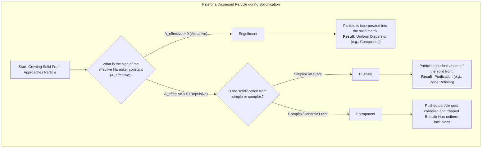
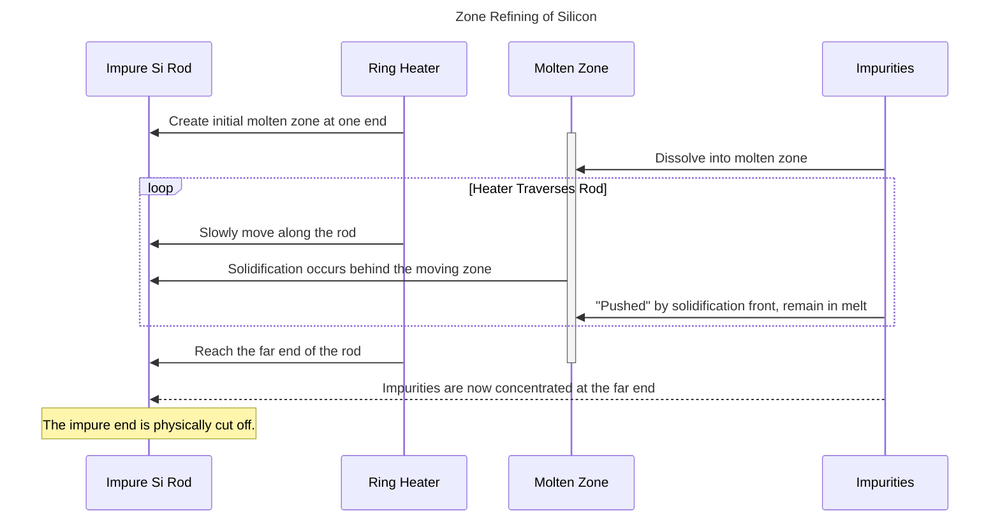
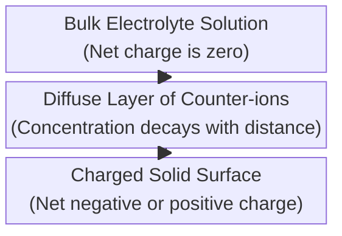
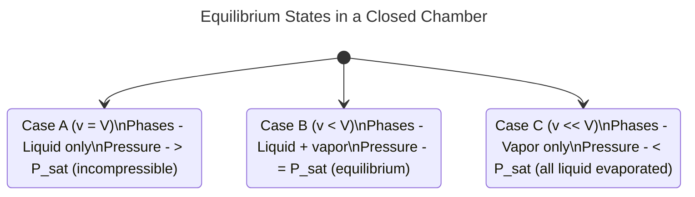
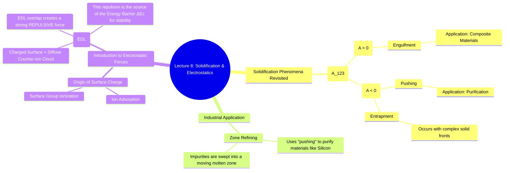

# Lecture 8: Solidification Phenomena and Introduction to Electrostatic Forces

<!-- prettier-ignore -->
!!! abstract "Key Concepts Introduced"
    This lecture revisits the critical phenomena of **pushing, entrapment, and engulfment** during solidification, clarifying their connection to the three-body interaction model. We will explore a major industrial application of this principle: the **zone refining** of silicon for the microelectronics industry. After working through a practical example, we will pivot to the second major force in colloidal systems: **electrostatic interactions**. We will discuss the origins of surface charge and introduce the concept of the **Electrical Double Layer (EDL)**, which is fundamental to understanding stability in many aqueous colloids.

---

## Watch here

## 1. Contextualizing Solidification: Pushing, Entrapment, and Engulfment

In our last session, we derived an expression for the effective interaction energy when two dissimilar materials (2 and 3) interact across an intervening medium (1). The sign of this interaction determines the fate of a dispersed particle during solidification. Let's clarify the roles of the three components in this context:

- **Material 3:** The **growing solid phase**.
- **Material 2:** The **liquid melt** from which the solid is growing.
- **Material 1:** The **dispersed particle** (e.g., impurity, secondary component) within the liquid melt.

The behavior is dictated by the effective Hamaker constant, $A_{123} \approx (\sqrt{A_{11}}-\sqrt{A_{22}})(\sqrt{A_{33}}-\sqrt{A_{22}})$.

- **If $A_{123} > 0$ (Attractive Interaction):** The growing solid (3) prefers to interact with the particle (1) rather than the liquid (2). This leads to **engulfment**, where the particle is incorporated into the solid matrix, resulting in a uniform dispersion. This is desirable for creating composite materials or alloys.
- **If $A_{123} < 0$ (Repulsive Interaction):** The growing solid (3) repels the particle (1). This leads to **pushing**, where the solidification front shoves the particles ahead of it, concentrating them in the remaining liquid. This is the basis for purification. **Entrapment** is a variation of pushing where a complex (e.g., dendritic) solidification front traps pockets of particle-rich liquid.

#### Application: The Power of Separation by Solidification

The difference in behavior between engulfment and rejection can be exploited as a powerful separation technique. Imagine you have a mixture of two different types of solid particles. If you disperse this mixture in a liquid that can be solidified, and one particle type is engulfed while the other is rejected, you can achieve separation. After solidification, the engulfed particles will be trapped within the solid matrix, while the rejected particles will be concentrated in a small remaining liquid fraction or pushed to the very end of the solid block. This principle is analogous to fractional distillation but occurs in the solid-liquid domain.

---

## 2. Industrial Application: Zone Refining of Silicon

The "pushing" phenomenon is not a theoretical curiosity; it is the cornerstone of the ultra-high purity materials processing required by the semiconductor industry.

**The Goal:** To produce silicon (or germanium) rods with extreme purity, often exceeding "six nines" (99.9999%) purity, as even trace impurities can drastically alter the material's electrical properties.

**The Process (Zone Refining):**

1.  **Start:** A relatively impure rod of the semiconductor material is placed in an inert atmosphere.
2.  **Melt Zone:** A narrow, ring-shaped heater is used to create a small molten zone in the rod.
3.  **Traversal:** The heater is slowly moved from one end of the rod to the other.
4.  **Solidification & Pushing:** As the heater moves, the material behind it cools and re-solidifies. Most impurities are repulsive to the solidifying silicon (i.e., $A_{effective} < 0$). Therefore, the solidification front **pushes** the impurities ahead of it, causing them to accumulate in the moving molten zone.
5.  **Concentration:** As the molten zone traverses the entire length of the rod, it acts like a broom, sweeping the impurities to the far end.
6.  **Finish:** At the end of the process, the vast majority of the rod is ultra-pure, and all the impurities are concentrated in the last section to solidify. This impure end is then physically cut off and either discarded or reprocessed.

By carefully controlling the speed and stability of the melt front to keep it flat, entrapment is minimized, leading to an extremely efficient purification process.

---

## 3. The Other Major Force: Electrostatics in Colloids

While Van der Waals forces are universal, they are often not the whole story, especially in aqueous systems. **Electrostatic forces** arising from surface charges play an equally, if not more, important role.

#### Origins of Charge in Colloidal Systems:

- **In the Liquid (Electrolytes):** Most liquids, especially water, contain dissolved ions. These can come from:
  - Added salts (e.g., NaCl).
  - Partial dissolution of the solid material itself.
  - The self-ionization of water ($H_2O \rightleftharpoons H^+ + OH^-$).
  - Impurities. It is exceptionally difficult to obtain perfectly ion-free water.
- **On the Surface:** Solid surfaces immersed in a liquid often acquire a net electrical charge. This can happen because:
  - Specific ions from the solution preferentially adsorb onto the surface.
  - Surface chemical groups ionize (e.g., a carboxylic acid group -COOH on a polymer surface deprotonating to -COO⁻).
  - Differential dissolution of ions from an ionic crystal.

#### The Electrical Double Layer (EDL)

When a charged surface is placed in an electrolyte solution, a charge redistribution occurs to maintain overall electroneutrality. This charge structure is known as the **Electrical Double Layer**.

 <!-- Placeholder for a diagram of the EDL -->

- **The Surface Charge:** The solid surface has an intrinsic net charge (negative in this diagram).
- **The Counter-ion Layer:** A layer of oppositely charged ions (called **counter-ions**, positive in this diagram) is attracted to the surface, neutralizing its charge.
- **Distribution of Ions:** This neutralizing layer is not a single, rigid sheet of ions. Instead, it's a diffuse cloud. There is a high concentration of counter-ions very close to the surface, and this concentration gradually decays back to the bulk electrolyte concentration further away from the surface. The distribution is a balance between electrostatic attraction pulling the counter-ions toward the surface and thermal energy (diffusion) trying to spread them out evenly.

The EDL is a crucial concept. When two colloidal particles approach each other, their diffuse electrical double layers begin to overlap. This overlap results in a strong **repulsive force**. This electrostatic repulsion is the missing piece of our puzzle—it is the primary source of the **repulsive energy barrier ($\Delta E_c$)** that prevents coagulation and provides kinetic stability to many colloidal systems.

---

## 4. In-Class Quiz & Discussion

**Question:** Consider a rigid, closed chamber of volume $V$, initially empty and under vacuum at a temperature $T$. A volume $v$ of a pure liquid (e.g., water), with a saturation vapor pressure of $P_{sat}$ at temperature $T$, is instantaneously placed inside. Describe the final equilibrium state of the system (phases present, pressure) for the following three cases:

(a) $v = V$
(b) $v < V$
(c) $v \ll V$ (assume the liquid is sufficient to create saturation if it all evaporates)

<!-- prettier-ignore -->
???+ solution "Quiz Answer Breakdown"
    This question tests fundamental concepts of phase equilibrium and vapor pressure.

    **(a) Case $v = V$ (Container is completely filled):**
    -   **Phases Present:** Only the **liquid phase**.
    -   **Pressure:** The pressure will be much higher than $P_{sat}$. Since liquids are nearly incompressible, the pressure will be determined by the bulk modulus of the liquid and how it resists the container walls. There is no empty space for vapor to form.

    **(b) Case $v < V$ (Container is partially filled):**
    -   **Phases Present:** Both **liquid and vapor phases will coexist** at equilibrium.
    -   **Pressure:** The liquid will evaporate until the partial pressure of its vapor in the headspace reaches the saturation vapor pressure. The final pressure in the chamber will be **$P = P_{sat}$**. This is the classic two-phase equilibrium condition.

    **(c) Case $v \ll V$ (Small amount of liquid in a large container):**
    -   **Phases Present:** Only the **vapor phase**.
    -   **Pressure:** The small amount of liquid will begin to evaporate to try and reach $P_{sat}$. However, because the volume of the container ($V$) is so large, the entire volume of liquid ($v$) will turn into vapor *before* the pressure reaches $P_{sat}$. The final pressure will be less than the saturation vapor pressure, calculated using the ideal gas law for the amount of substance in volume $v$: **$P = nRT/V < P_{sat}$**.

---

## 📖 Glossary of New Terms

- **Electrical Double Layer (EDL):** The structure comprising the charge on a surface and the balancing layer of counter-ions in the surrounding electrolyte solution.
- **Counter-ions:** In an electrolyte solution, the ions that have a charge opposite to that of a nearby surface.
- **Solidification Front:** The moving interface between the solid and liquid phases during a solidification process.
- **Vapor Pressure ($P_{sat}$):** The pressure exerted by a vapor in thermodynamic equilibrium with its condensed phases (solid or liquid) at a given temperature in a closed system.
- **Zone Refining:** A method of purifying crystalline solids, especially semiconductors, in which a narrow molten zone is moved along the crystal, concentrating impurities at one end.

---

## 📊 Concept Map

### 1. Solidification Phenomena (Flowchart)

This flowchart illustrates the decision process that determines the fate of a dispersed particle at a solidification front, based on the sign of the effective Hamaker constant.

### 2. Zone Refining Process (Sequence Diagram)

A `sequenceDiagram` is a great way to show the step-by-step, time-ordered process of zone refining.

### 3. Formation of the Electrical Double Layer (Block Diagram)

This `block-beta` diagram provides a simple, layered visualization of the components that make up the Electrical Double Layer (EDL).

### 4. In-Class Quiz Logic (State Diagram)

A `stateDiagram-v2` can effectively model the different equilibrium states of the system in the quiz, with transitions based on the initial conditions.

### 5. Overall Lecture Concept Map (Mindmap)

This mindmap summarizes the key topics of the lecture, connecting the practical application of solidification to the introduction of the new fundamental force (electrostatics).

